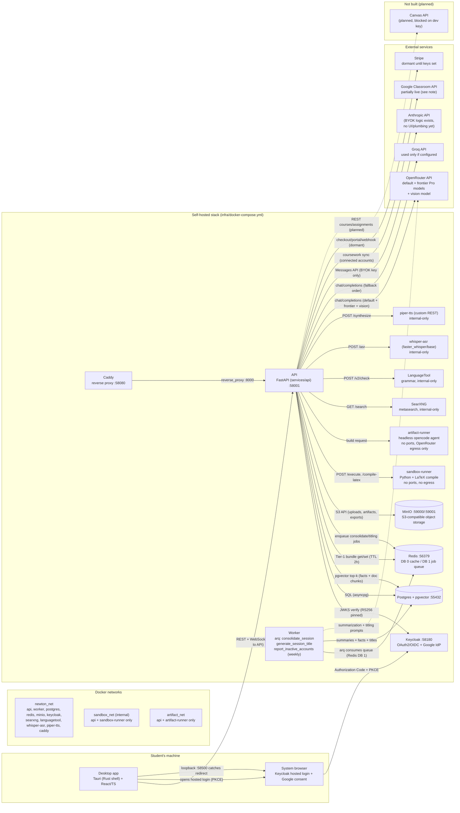
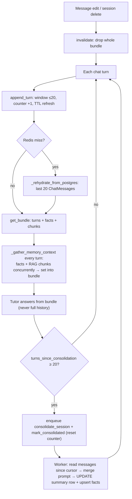
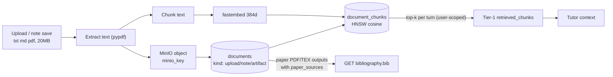
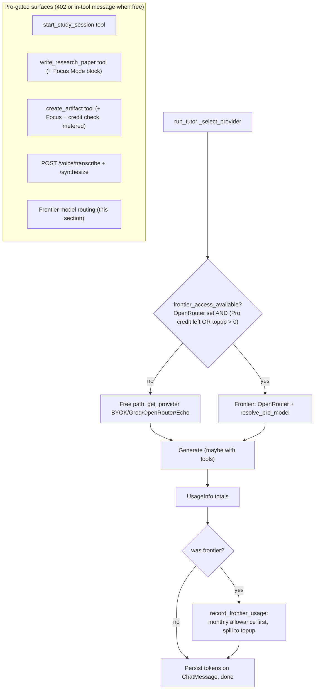
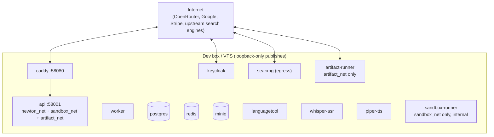

# Newton — System Architecture

This document describes what is actually implemented in this repository today, cross-checked
against the code (not just the original design plan). See [`ROADMAP.md`](../ROADMAP.md) for the
live, per-item build ledger — `#` done, `!` not started. Anything below marked **(planned)** is
described in the original plan but has no corresponding code yet; it is included so the diagrams
show where today's pieces fit into the longer-term design, not because it exists.

> Audit note (2026-09-17): this file previously showed `sandbox-runner`, SearXNG, MinIO upload,
> and document RAG as "planned", and login as an OAuth2 password grant. All four are live, and
> login is now Authorization Code + PKCE. The topology, auth, and chat-turn diagrams below were
> rewritten against `infra/docker-compose.yml`, `services/api/app/routers/chat.py`,
> `services/api/app/agents/tutor.py`, and `apps/desktop/src/auth.ts`. Dated claims were removed
> rather than patched in place.

Per-tool detail lives in [`tools.md`](./tools.md); the full schema in [`erd.md`](./erd.md);
privacy posture in [`data-retention-and-privacy.md`](./data-retention-and-privacy.md).

## 1. System topology

Live services in `infra/docker-compose.yml`: `postgres`, `redis`, `minio`, `keycloak`, `api`,
`worker`, `caddy` — plus `sandbox-runner`, `artifact-runner`, `searxng`, `languagetool`,
`whisper-asr`, `piper-tts`. Only `postgres`, `redis`, `minio`, `keycloak`, `api`, and `caddy`
publish loopback ports; everything else is reachable only over its Docker network via `api`.



**Notes on the diagram:**
- Solid edges are implemented; dashed edges have no implementation yet. Canvas is the only
  remaining "planned" integration: no service, route, or client exists for it.
- Google Classroom is **partially** live, not planned: `google_classroom_connections` table
  (Fernet-encrypted tokens), Classroom router (`/connect`, `/sync`), and the
  `sync_google_classroom` chat tool all exist and are tested short of the real Google consent
  screen, which is blocked on registering the redirect URI on the shared Google Cloud OAuth
  client. See [`ROADMAP.md`](../ROADMAP.md) Phase 3.
- MinIO is fully live: document upload (txt/md/PDF via `pypdf`, 20MB cap) → chunk → fastembed
  embed → pgvector retrieval. The old "no upload endpoint yet" note was stale.
- `sandbox-runner` sits on `sandbox_net` (`internal: true` — no route to the internet or any
  other service); `artifact-runner` sits on `artifact_net` (OpenRouter egress only, no route to
  postgres/redis/minio/keycloak). `api` is the single container on all three networks and the
  only caller of either runner. See §7.
- The desktop app talks to the API directly over loopback (`127.0.0.1:58001`); Caddy fronts
  port 80 for a future non-loopback deploy but is not in the desktop path today.

## 2. Auth: Authorization Code + PKCE (not password grant)

Login was rebuilt from OAuth2 password grant to Authorization Code + PKCE with Google brokered
through Keycloak. A Rust loopback listener (port 58500, 15-minute window) catches the browser
redirect; `TokenManager` refreshes proactively. Keycloak is backed by its own Postgres database
(the old ephemeral `--import-realm` startup wiped every account on restart).

```mermaid
sequenceDiagram
    actor Student
    participant App as Desktop app
    participant Loop as Loopback :58500 (Rust)
    participant Browser as System browser
    participant KC as Keycloak
    participant Google as Google (IdP)
    participant API as API

    Student->>App: clicks Sign in
    App->>App: generates PKCE verifier + challenge (S256)
    App->>Browser: opens Keycloak auth URL (challenge, redirect to :58500)
    Browser->>KC: hosted login page
    alt Email/password
        Student->>KC: credentials (+ email verification on signup via Brevo SMTP)
    else Sign in with Google
        KC->>Google: brokered OIDC login
        Google-->>KC: identity assertion
    end
    KC-->>Browser: redirect with authorization code
    Browser->>Loop: GET /callback?code=...
    Loop->>App: hands over code (Tauri event)
    App->>KC: token exchange (code + verifier)
    KC-->>App: access_token (JWT) + refresh_token
    App->>API: REST / WS with Bearer token
    API->>KC: fetch JWKS (cached, RS256 pinned) to verify
    API-->>App: get_or_create_user() JIT-provisions row from sub claim
    Note over App,KC: TokenManager refreshes before expiry; no raw passwords ever touch the app
```

## 3. End-to-end: a real chat turn (current)

Single Tutor agent with a 6-round tool loop (`calculator`, `unit_converter`, `symbolic_math`,
`web_search` always loaded; the rest via one `use_capability` round; `read_image` appended
deterministically on attached-image markers). WS frames: `user_message` / `ping` / `stop` in;
`user_message_saved`, `plan_chunk`, `chunk`, tool started/finished, `suggested_action`,
`done`/`stopped`/`error` out. Crisis-pattern messages short-circuit the whole pipeline with a
fixed resource reply. Detail: [`tools.md`](./tools.md).

```mermaid
sequenceDiagram
    actor Student
    participant App as Desktop app
    participant API as API (FastAPI + WS)
    participant Redis as Redis (Tier 1)
    participant PG as Postgres (Tier 2/3 + RAG)
    participant Tutor as Tutor (agents/tutor.py)
    participant Provider as Provider (OpenRouter default<br/>/ frontier Pro / Groq / Echo)
    participant Worker as arq Worker

    Student->>App: types message (or picks image / option / plan approval)
    App->>API: WS {type: user_message, content}
    API->>PG: INSERT chat_messages (role=user)
    API->>Redis: append_turn() — TTL-refreshed window (≤20 turns)
    App<-API: WS {type: user_message_saved, id}

    alt Crisis pattern matches (local, no LLM call)
        API->>PG: INSERT fixed resource reply (role=assistant)
        API->>Redis: append_turn() assistant
        API-->>App: WS chunk + done (crisis, no usage)
    else Normal turn
        API->>PG: retrieve_relevant_facts() + retrieve_relevant_chunks()<br/>concurrently (pgvector top-k, own DB sessions)
        API->>Redis: set_profile_facts() + set_retrieved_chunks()
        API->>Tutor: run_tutor(session_id, message, user_id)
        Tutor->>Redis: get_bundle() — turns + facts + chunks (+ rehydrate from PG on cold cache)
        Tutor->>Provider: plan-narration call (races first answer byte; skipped silently if slow/unconfigured)
        Provider-->>App: WS {type: plan_chunk} (only if narration wins the race)
        loop Up to 6 tool rounds
            Tutor->>Provider: stream_chat(system + facts + chunks + history + tools)
            alt ToolCallRequest
                Tutor->>Tutor: run use_capability inline OR registry.run_tool() (session_id/user_id injected, never model-set)
                Tutor-->>App: WS tool started/finished (+ suggested_action panel hint)
            else Final text
                Provider-->>App: WS {type: chunk} streaming, incl. math-steps / plotly-figure / paper-plan / artifact-plan blocks
            end
        end
        Tutor-->>API: UsageInfo(prompt, completion) totals
        API->>PG: INSERT chat_messages (role=assistant, full text + token counts)
        API->>Redis: append_turn() assistant
        API->>Redis: after 2nd assistant reply — enqueue generate_session_title (once)
        API->>Redis: every 20 appended turns — enqueue consolidate_session + reset counter
        API-->>App: WS {type: done, prompt_tokens, completion_tokens}
    end

    Redis->>Worker: arq delivers jobs
    Worker->>PG: titling → UPDATE chat_sessions.title (no-op if already set)
    Worker->>PG: consolidation → read only messages since last_message_created_at cursor
    Worker->>Provider: stream_chat(summarization or merge prompt, no tools)
    Worker->>PG: upsert session_summaries row (Tier 2) + upsert_fact() per durable fact (Tier 3)
```

**What the diagram elides:** with no `GROQ_API_KEY`/`OPENROUTER_API_KEY` configured,
`Provider` resolves to the keyless `EchoProvider`, which echoes the last message word-by-word
so the whole pipeline stays runnable with zero external keys. Frontier routing (Pro monthly
credit → top-up spill, quiet fallback to free-tier model) is §6; it never errors, it just
changes which OpenRouter model id answers.

**BYOK Anthropic, as it stands:** `get_provider(byok_anthropic_key=...)` prefers a
caller-supplied key over Groq/OpenRouter, but no endpoint or desktop UI collects or stores one
(no column, no encryption) — the selection logic exists, the plumbing does not.

## 4. Memory lifecycle (three tiers, one diagram)

Tier 1 is a Redis bundle (`turns` ≤ 20, `profile_facts`, `retrieved_chunks`,
`turns_since_consolidation`, 2h TTL) with Postgres rehydration on cold cache and full-drop
`invalidate()` only on message-edit truncation / session delete — **not** on consolidation.
Tier 2 compacts incrementally: `consolidate_session` reads only messages newer than
`session_summaries.last_message_created_at` and merges them into the existing row (full
transcript only on first run), so lifetime token cost grows linearly, not quadratically.
Tier 3 upserts typed facts deduped by a partial unique index (see [`erd.md`](./erd.md)).



## 5. Document + RAG pipeline (live)

Upload (txt/md/PDF via `pypdf`, 20MB cap) → MinIO bytes → chunk → fastembed
(`BAAI/bge-small-en-v1.5`, 384 dims) → `document_chunks` HNSW rows → per-turn top-k retrieval
scoped to the calling user, injected through the same Tier-1 bundle slot as profile facts.
Notes (`kind=note`, grown via `PATCH /notes`) and artifacts (`kind=artifact`) are real
`documents` rows, so notes are RAG-retrievable with zero extra logic. Cross-user isolation is
tested (identical content, per-user retrieval).



## 6. Billing, frontier routing, and Pro gates

Free-tier default is the configured OpenRouter model (`deepseek/deepseek-v4-flash-0731`); the
legacy `get_provider()` order (BYOK > Groq > OpenRouter > Echo) still decides the free path.
A turn routes to a frontier Pro model only when `frontier_access_available` holds (OpenRouter
configured **and** Pro monthly credit left **or** nonzero top-up balance), resolving via
`resolve_pro_model` (user's `preferred_pro_model` or roster default). Spend is charged once per
turn by `record_frontier_usage` — monthly allowance first, spill onto non-expiring top-up —
and exhausted credit falls back to the free model silently, never an error. Stripe
(subscription + top-up checkout + webhook) is dormant until its three secrets are set.



Free/Pro generation counts (`FREE_GENERATION_TARGET` 5 vs `PRO_GENERATION_TARGET` 15 per call)
are item-count differences, not time-based caps — unlimited separate calls on either plan.

## 7. Deployment and network isolation

Three Docker networks; `api` is the only container on all three. Runners expose no ports;
only `api` over their private net can call them. The sandbox has no egress at all
(`internal: true`); the artifact runner needs OpenRouter egress but has no route to any state
(its isolation rationale is `services/artifact-runner/README.md`). Published loopback ports:
`58001` api, `58080` caddy, `55432` pg, `56379` redis, `59000/59001` minio, `58180` keycloak.



Resource limits are per-container (`api`/`worker` 640m, `keycloak` 900m, `whisper-asr` 1536m,
etc. — see compose). CI (`.github/workflows/test.yml`) runs the API suite hermetically
(self-signed JWKS, disposable Postgres/Redis/MinIO) with 9 `live_smoke` tests excluded.

## 8. Why it's built this way

**Self-hosted, not managed cloud.** Relational data, vectors, object storage, auth, search,
grammar, STT/TTS, and code execution all run in `infra/docker-compose.yml` on infrastructure
the project owns — no Firebase, no managed SaaS for its own state. Canvas and Google Classroom
are the deliberate exception: external SaaS the *student* already uses ("connecting outward"),
not the project's own infra. Stripe/Sentry/Google-login are outbound integrations of the same
kind, each dormant until configured.

**BYOK + frontier routing to avoid eating API cost.** Default traffic rides cheap
free-tier-friendly models; users who want frontier quality fund it via Pro subscription or
prepaid top-up, tracked per-token in `credits_used_cents` / `topup_credits_cents`. The operator
never pays for BYOK Anthropic tokens at all.

**Three-tier memory, so remembering doesn't mean re-reading.** Hot Redis window, warm
incremental per-session summaries, cold typed deduped facts — each turn pulls top-k relevant
facts and chunks, never the whole history. Dedup is structural (partial unique index), not a
convention callers must remember.

**Tools over prose.** The Tutor verifies with real tools (SymPy, sandbox, search, vision,
LanguageTool, deterministic citation formatting, real DB-backed generation) and relays
structured outputs verbatim (`math-steps`, `plotly-figure`, `paper-plan`, `artifact-plan`,
`newton-artifact`) instead of re-describing them. Failures are strings the loop can react to,
never turn-killing exceptions.

**Where this sits in the roadmap.** Phases 1–4 and 6 are substantially live (tutor loop,
memory, RAG, full 21-tool belt, math notepad, visualization panel, Classroom sync short of the
consent-screen round trip, flashcards/FSRS, adaptive exams, writing tools, study sessions,
research-paper writer, artifacts, billing foundations, retention reporting). Explicitly
**not built**: Canvas connector, global-hotkey visual confirmation, tray/notepad/notifications
visual confirmations, desktop voice-capture UI, live Stripe round trip, a second staging
environment, and Phase 5 scale-out. See [`ROADMAP.md`](../ROADMAP.md) for the per-item ledger.
