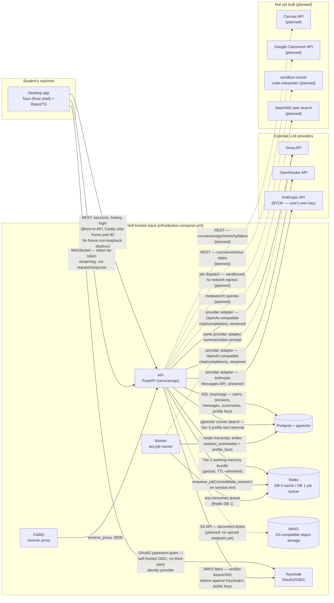

# Newton — System Architecture

This document describes what is actually implemented in this repository today, cross-checked
against the code (not just the original design plan). See [`ROADMAP.md`](../ROADMAP.md) for the
live, per-item build ledger — `#` done, `!` not started. Anything below marked **(planned)** is
described in the original plan but has no corresponding code yet; it is included so the diagrams
show where today's pieces fit into the longer-term design, not because it exists.

## 1. System topology



**Notes on the diagram:**
- Solid edges are implemented and exercised by the current code; dashed edges are described in
  the original plan (`crystalline-bubbling-deer.md`) but have no implementation yet.
- MinIO is provisioned in `infra/docker-compose.yml` and the `documents`/`document_chunks` tables
  exist in the schema, but there is no upload router, no chunker, and no embedding pipeline —
  hence the dashed "planned" edge from API to MinIO even though the container itself is running.
  See [`erd.md`](./erd.md) for the schema-only-vs-active table breakdown.
- Canvas, Google Classroom, the code-interpreter sandbox, and SearXNG are **not present anywhere
  in the running stack** — no service, no route, no client. `infra/docker-compose.yml` today only
  runs `postgres`, `redis`, `minio`, `keycloak`, `api`, `worker`, and `caddy`; the plan's
  `sandbox-runner`, `searxng`, and `languagetool` services are not (yet) in the compose file.
- The desktop app talks to the API directly over the loopback ports published by
  `docker-compose.yml` (e.g. `127.0.0.1:58001`); Caddy exists as the reverse-proxy entry point for
  a future non-local deployment, but the desktop app's `api.ts` does not go through it today.

## 2. End-to-end sequence: a real chat turn

This is the one flow that is fully built and verified end-to-end today: sign-in, session
creation, a streamed chat turn, persistence, and post-session memory consolidation.

```mermaid
sequenceDiagram
    actor Student
    participant Desktop as Desktop app
    participant KC as Keycloak
    participant API as API (FastAPI)
    participant Redis as Redis (Tier 1)
    participant PG as Postgres (Tier 2/3)
    participant Router as Router (agents/router.py)
    participant Tutor as Tutor agent
    participant Provider as Provider adapter<br/>(Groq/OpenRouter/BYOK Anthropic/Echo)
    participant Worker as arq Worker

    Student->>Desktop: enters username/password
    Desktop->>KC: POST /realms/newton/protocol/openid-connect/token<br/>(OAuth2 password grant, client_id=newton-api)
    KC-->>Desktop: access_token (JWT)

    Desktop->>API: POST /chat/sessions (Bearer token)
    API->>KC: fetch JWKS (cached 5 min) to verify token
    API->>PG: get_or_create_user(); INSERT chat_sessions row
    API-->>Desktop: { session_id }

    Desktop->>API: WS /chat/ws/{session_id}?token=...
    API->>KC: verify token (decode_token — WS can't send an Authorization header)
    API-->>Desktop: accept

    Student->>Desktop: types a message
    Desktop->>API: WS: raw text (client message = plain string)

    API->>PG: INSERT chat_messages (role=user)
    API->>Redis: append_turn() — push turn into Tier-1 bundle
    API->>PG: retrieve_relevant_facts() — pgvector top-k cosine search<br/>over this user's current (non-superseded) profile_facts
    API->>Redis: set_profile_facts() — write matched facts into the Tier-1 bundle
    API->>Router: route(user_message)
    Router-->>API: RoutePlan(agent="tutor")  (only agent that exists today)

    API->>Tutor: run_tutor(session_id, message)
    Tutor->>Redis: get_bundle() — recent turns + retrieved profile facts
    Tutor->>Provider: stream_chat(system + facts + history + message)
    Provider-->>Tutor: response text, chunk by chunk
    loop each chunk
        Tutor-->>API: yield chunk
        API-->>Desktop: WS { "type": "chunk", "content": "..." }
    end
    API-->>Desktop: WS { "type": "done" }

    API->>PG: INSERT chat_messages (role=assistant, full text)
    API->>Redis: append_turn() — assistant turn into Tier-1 bundle

    Student->>Desktop: ends the session
    Desktop->>API: POST /chat/sessions/{id}/end
    API->>PG: status="ended", ended_at=now()
    API->>Redis: enqueue_job("consolidate_session", session_id)  (arq queue, Redis DB 1)
    API-->>Desktop: { status: "ended", consolidation: "queued" }

    Redis->>Worker: arq delivers consolidate_session job
    Worker->>PG: read full transcript for the session
    Worker->>Provider: stream_chat(summarization prompt)
    Provider-->>Worker: JSON {topics, problems_solved, mistakes,<br/>actions_taken, profile_facts[]}
    Worker->>PG: INSERT session_summaries (Tier 2)
    Worker->>PG: upsert_fact() per durable fact —<br/>reconfirm same value, or supersede + insert (Tier 3, dedup-by-construction)
    Worker->>Redis: invalidate(session_id) — drop the now-stale Tier-1 bundle
```

**What the diagram elides, and why it's still accurate:** if no `GROQ_API_KEY` or
`OPENROUTER_API_KEY` is configured and no BYOK Anthropic key was supplied, `Provider` above
resolves to the keyless `EchoProvider` (`services/api/app/providers/echo.py`), which echoes the
user's last message back word-by-word. That's a deliberate fallback so the whole pipeline — WS
streaming, persistence, Tier-1/2/3 memory — is runnable and testable with zero external API keys;
per `ROADMAP.md` it is "verified end-to-end on Echo" but "not yet exercised against a real
Groq/OpenRouter/Anthropic key."

**BYOK Anthropic, as it stands:** `get_provider(byok_anthropic_key=...)` and `run_tutor(...,
byok_anthropic_key=...)` both accept a caller-supplied key and, if present, prefer it over Groq/
OpenRouter. However, there is currently no API endpoint or desktop UI that lets a user submit or
store that key — no `users` table column, no encryption-at-rest (the plan's "pgcrypto" storage is
not implemented), nothing in `api.ts`/`App.tsx` collects one. The provider-selection *logic* for
BYOK exists; the *plumbing* to actually supply a key from the app does not yet.

## 3. Why it's built this way

**Self-hosted, not managed cloud.** Every piece of durable state — relational data, vectors,
object storage, auth — runs in `infra/docker-compose.yml` on infrastructure the project owns
(Postgres+pgvector, MinIO, Keycloak), not a managed SaaS. This was an explicit constraint from the
original plan ("no Firebase/Firestore, no managed cloud services... all self-hosted, all ours"),
carried over from Newton 1.0's Firebase-based predecessor specifically to avoid vendor lock-in and
per-seat/per-call cloud billing. Canvas and Google Classroom are the deliberate exception: they're
external SaaS the *student* already uses, which the plan treats as "connecting outward," distinct
from the no-managed-cloud rule that governs the project's *own* infrastructure.

**BYOK Anthropic to avoid eating API cost.** The product's own usage (no user key configured) runs
on Groq and OpenRouter — cheap/free-tier-friendly APIs — rather than Anthropic's metered API, so
running the service doesn't accrue per-token cost to the operator. A user who wants Claude-quality
answers can supply their own Anthropic key (BYOK) and calls made with it bypass Groq/OpenRouter
entirely; the operator never pays for those tokens. `services/api/app/providers/registry.py`
encodes exactly this precedence: BYOK Anthropic key > Groq > OpenRouter > keyless Echo.

**Three-tier memory, so "remembering the student" doesn't mean re-reading everything.** Feeding a
model the entire chat history every turn is slow, expensive, and (per the plan) accumulates
duplicate/contradictory facts forever. Instead:
- **Tier 1 (Redis, hot):** the assembled per-session context bundle — recent turns plus the
  profile facts relevant to the *current* message — cached and TTL-refreshed rather than rebuilt
  from Postgres on every turn.
- **Tier 2 (Postgres `session_summaries`, warm):** a structured, cheap-model summary produced once
  a session ends (topics, problems solved, mistakes, actions taken) — a scannable digest instead
  of a raw transcript.
- **Tier 3 (Postgres + pgvector `profile_facts`, cold/durable):** typed, deduplicated facts about
  the student that persist across sessions, retrieved by small top-k similarity search so a given
  turn only pulls in what's relevant to it. See [`erd.md`](./erd.md) for how dedup is enforced
  structurally rather than by application logic remembering to check first.

**Where this sits in the roadmap.** What's described above — Router→Tutor, WS streaming, Postgres
chat history, and all three memory tiers — is Phase 1 of the plan and is marked done in
[`ROADMAP.md`](../ROADMAP.md). Still explicitly **not built**, even though parts of it appear in
the plan and in this repo's directory layout:
- **Document RAG** — `documents`/`document_chunks` tables and their pgvector HNSW indexes exist
  (migration `0001_initial.py`), but there is no upload endpoint, no chunker, and no embedding
  pipeline wired to them yet.
- **The rest of the tool belt** — code-interpreter sandbox, SearXNG web search, vision
  capture-to-solve, calculator/unit converter — none of these exist as code or as running
  services; `Router.route()` currently has exactly one branch (`tutor`) and is written to be the
  seam later specialist agents (Math Solver, Visualizer, Study Planner, ...) will plug into, not a
  placeholder needing a rewrite.
- **Phases 2–5** (math notepad/visualization, Canvas/Classroom integrations, flashcards/quizzes,
  desktop-native power features, scale-out) are entirely unbuilt design at this point — see
  `ROADMAP.md` for the current per-item status of each.
