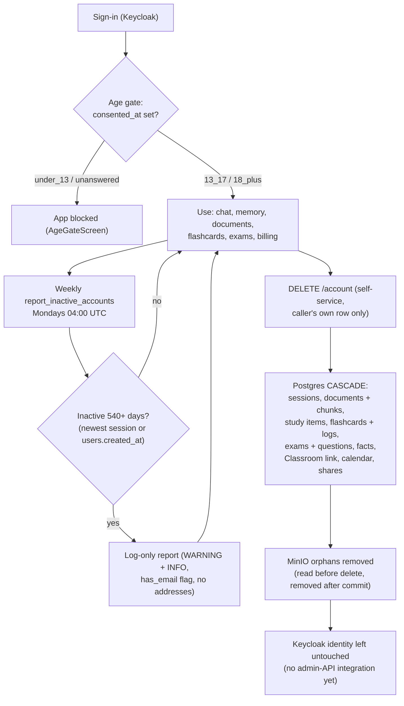

# Data retention & privacy — what this session built, and what's still missing

This document explains what was actually implemented for ROADMAP.md Phase 7's
"explicit FERPA/COPPA/GDPR data-retention posture" item, the real decisions made along
the way, and — most importantly — an explicit, honest list of what still needs real
legal review before any of this is customer-facing or authoritative.

**Read this before treating any of the artifacts below as finished compliance work.
They are a solid first draft with clearly flagged gaps, not a compliance
determination.**

## Data lifecycle at a glance

Descriptive of implemented behavior only — not a retention schedule (none has legal sign-off;
see the gap list at the bottom).



`DELETE /account` is the only deletion path; the retention job never deletes, disables, or
emails anyone (the `api`/`worker` service has no outbound-email capability — only Keycloak has
SMTP, for its own verification/reset mail). Full table: [`erd.md`](./erd.md).

## What was built

1. **`PRIVACY_POLICY.md`** (repo root) — a draft privacy policy grounded in Newton's
   real database schema (`services/api/app/db/models.py`), read in full and mapped
   category by category: account info, chat messages, session summaries/profile facts
   (memory), uploaded documents, study plan items, the Google Classroom connection,
   flashcards/review logs, practice exams, billing metadata, the crisis-detection
   safety net's log-only behavior, the new age-band/consent field, and technical/log
   data. For each: what it is, why it's collected, real retention (tied to the actual
   working `DELETE /account` cascade, not an invented story), and who it's actually
   shared with (OpenRouter/Groq as the configured LLM provider, Google only if
   Classroom is connected or Google login is used, Stripe only if billing is
   configured, Sentry only if configured, and a specific, real, so-far-undisclosed-
   in-product disclosure about the Meta Muse Spark Contributor Pro model's training-
   data-consent tradeoff — see `app/services/billing.py`'s `PRO_MODELS` and
   ROADMAP.md's "Independent product & engineering review" section for the underlying
   decision this discloses).

   It is marked as a DRAFT, prominently and repeatedly, in its own text — not just in
   this internal doc.

2. **Minor-consent / age-gate scaffolding** — a real, working first pass, not just a
   design doc:
   - Migration `services/api/migrations/versions/0014_age_band_consent.py` adds
     `age_band` (nullable string: `"under_13"` / `"13_17"` / `"18_plus"`) and
     `consented_at` (nullable timestamp) to `users`.
   - `app/routers/account.py` gained `GET /account` (read the current consent status)
     and `POST /account/age-consent` (record an answer). Answering `"under_13"` is
     recorded but **deliberately never sets `consented_at`**, so the account stays
     gated — see the Decisions section below for why.
    - The desktop app gained `AgeGateScreen.tsx`, wired into `App.tsx` right after
      sign-in and before anything else renders: it blocks the whole app until
      `consented_at` is set, checked fresh from the server on every sign-in (not a
      local "seen once" flag like the existing onboarding welcome card, since this
      needs to mean something as a record, not just avoid pestering the user).

```mermaid
sequenceDiagram
    actor Student
    participant App as Desktop app
    participant API as API
    participant PG as Postgres (users)

    App->>API: GET /account (fresh every sign-in)
    API->>PG: read age_band + consented_at
    alt consented_at set (13_17 / 18_plus)
        API-->>App: needs_consent=false → enter app
    else under_13 (recorded, consented_at stays null)
        API-->>App: needs_consent=true → blocked, parent-involvement message, no click-through
    else never answered
        App->>Student: AgeGateScreen (self-reported band, not birthdate)
        Student->>App: picks under_13 / 13_17 / 18_plus
        App->>API: POST /account/age-consent
        API->>PG: store age_band; set consented_at only for 13_17 / 18_plus
    end
    Note over App,API: Frontend fetch failure fails OPEN (lets the student in) —<br/>a deliberate resilience choice; see gap 9.
```

3. **A real, running data-retention job** — `app/jobs/retention.py`'s
   `report_inactive_accounts`, registered as a weekly `arq` cron job in
   `app/jobs/worker.py` (Mondays 04:00 UTC), plus a pure, directly-testable
   `find_inactive_accounts(db, threshold_days=..., now=...)` underneath it.

4. **Tests** for everything actually implemented:
   `services/api/tests/test_account_consent.py` (router-level: auth required,
   rejects an invalid `age_band`, `under_13` never clears `needs_consent`, `13_17`/
   `18_plus` do, switching away from `under_13` un-blocks), `test_retention.py`
   (the real selection logic: recently-active not flagged, long-inactive flagged
   using its *most recent* session not just any session, never-active-but-old falls
   back to `users.created_at`, never-active-but-new is not flagged, threshold is a
   real honored parameter), and frontend tests in `App.test.tsx` (age gate blocks the
   app, `18_plus` unlocks it, `under_13` stays blocked) and a dedicated
   `AgeGateScreen.test.tsx` covering the component in isolation including its error
   path and the "pick again" recovery for a misclick.

## Real decisions made this session, and the reasoning

### Retention threshold: 540 days (~18 months) of inactivity, report-only
"Inactivity" is measured as the most recent `chat_sessions.created_at` a user owns
(starting a chat is the one action every real use of the app funnels through), falling
back to `users.created_at` for an account that never started a single session.
540 days was chosen to comfortably span one full school year plus the summer breaks on
both sides of it, so a student who only opens Newton during the school year is never
flagged just for going quiet over a single summer, while still being short enough that
a genuinely abandoned signup doesn't sit invisible forever. **This is a first-pass
number chosen by this session, not a legally-reviewed retention schedule.**

The job is **report-only**: it logs which accounts would be affected (a WARNING
summary line plus one INFO line per flagged account, deliberately carrying a
`has_email` boolean instead of the actual address) and returns a structured result —
it does not delete, disable, or email anyone. Two real reasons, not laziness:

1. Auto-deleting real student data on an unreviewed retention policy is exactly the
   kind of decision that needs real legal sign-off first — shipping it unreviewed
   would be worse than shipping nothing.
2. **This API/worker service genuinely has no outbound-email capability of its own to
   check first.** The only SMTP configuration anywhere in this stack is Keycloak's own
   realm SMTP (`infra/keycloak/setup_smtp.py`), wired for Keycloak's own
   account-verification/password-reset emails — there is no equivalent path for the
   `api`/`worker` process to send a "your account will be considered for deletion"
   notice through. Verified this by reading the relevant code, not assuming it.
   Building a real outbound-email capability for the app itself is separate work.

### Age-gate mechanism: a self-reported age band, "under 13" blocks but never grants access
Researched the real baseline before designing anything: COPPA (Children's Online
Privacy Protection Act, enforced by the FTC) requires **verifiable parental consent**
before collecting personal information from a child under 13 in the US — not just a
notice, and not satisfied by a child (or anyone) simply clicking a button asserting
their own age. Newton previously asked for age/birthdate nowhere at all.

The approach implemented: an age-**band** gate (not exact birthdate, which is itself
more sensitive than needed) shown once per account at first sign-in. `"13_17"` and
`"18_plus"` answers unlock the app and record a timestamp. **`"under_13"` is recorded
but deliberately does NOT unlock the app** — the student sees a message that a parent
or guardian needs to be involved, with no way to click through it. This was a
deliberate choice over the alternative (silently letting them in, or worse, pretending
a checkbox constitutes real consent): a gate that's honest about not being COPPA-
sufficient is better than one that creates a false impression of compliance.

**This still is not COPPA compliance.** See the gap list below.

## Explicit gaps — what a real lawyer/compliance review needs to close

This is the most important section of this document. Do not treat any of the above as
finished. In order of how much they worry the person who built this:

1. **COPPA verifiable parental consent is not implemented.** The age-gate blocks
   self-reported under-13 signups from proceeding, which is a real, meaningful
   improvement over asking nothing at all — but it is not itself a verifiable-parental-
   consent mechanism (e.g. a credit-card-verification, signed consent form, or one of
   the FTC's other approved methods). Until one exists, Newton should not represent
   itself as able to lawfully serve under-13 users, and the current "under_13 → blocked,
   contact us" message doesn't actually connect anywhere yet — there is no real intake
   flow for a parent who reaches out. **This needs real product + legal work before
   Newton can either (a) actually onboard under-13 users lawfully, or (b) confidently
   assert it doesn't serve them.**

2. **`PRIVACY_POLICY.md` has not been reviewed by a lawyer.** It's grounded in real
   code, not boilerplate, but "grounded in real code" and "legally sound" are different
   bars. In particular: the Meta Muse Spark Contributor disclosure is a real, deliberate
   call this session made to keep the policy honest — but it surfaces a genuine tension
   with the *existing, separately-made* product decision (recorded in ROADMAP.md) not to
   disclose that tradeoff in-product. That tension needs a real decision from whoever
   owns both calls, not just this document quietly picking a side.

3. **No FERPA analysis has been done at all.** Newton plausibly handles what could be
   considered education records for minors depending on institutional context (uploaded
   syllabi, grades/scores on generated exams, performance data). Whether/how FERPA
   applies (e.g. if a school ever became a "customer" acting as the educational agency,
   vs. an individual student using this directly) was explicitly out of this session's
   depth and is not addressed anywhere in the new policy beyond a section header.

4. **No data processing agreement (DPA) scaffolding exists.** Nothing here produces a
   DPA for a school/district customer, or documents Newton's own role (controller vs.
   processor) under any framework. If Newton is ever sold to schools, this is real,
   separate legal work.

5. **Technical/operational log retention has no defined policy.** The crisis-detection
   log lines, correlation-id logs, and any Sentry error data (if configured) are
   currently subject to whatever the deployment's own log infrastructure happens to do
   — no explicit retention window, rotation policy, or deletion mechanism was defined or
   built for these in this session.

6. **`ProfileFact` (Tier-3 memory) has no default expiration.** Individual facts *can*
   carry an `expires_at`, but nothing sets one by default, so in practice these persist
   indefinitely until account deletion. Worth a real product decision: does a "struggles
   with fractions" fact from two years ago still deserve to shape a student's
   experience today?

7. **The retention job is report-only by explicit scope decision, not because the
   scope question is resolved.** Someone still needs to decide: should truly dormant
   accounts eventually be notified and/or deleted? If yes, that requires (a) building
   real outbound email for the `api`/`worker` service (doesn't exist today — see
   above), and (b) a real decision about what "inactive" should actually trigger
   (notify only? auto-delete after a further grace period? require an explicit opt-in
   renewal?). 540 days was this session's best-reasoned guess at a threshold, not a
   number anyone with legal authority has signed off on.

8. **No real contact channel exists for privacy questions/requests** (data access,
   correction, deletion-on-behalf-of-a-minor requests from a parent, etc.) beyond the
   account owner's own deletion self-service. `PRIVACY_POLICY.md`'s contact section is
   explicitly a placeholder.

9. **The age-gate's failure mode is "fail open."** If the frontend can't reach
   `GET /account` (a network blip, the API being briefly down), `App.tsx` currently lets
   a signed-in user into the app rather than blocking them — a deliberate resilience
   choice so a transient error doesn't lock a legitimate student out, but it also means
   the gate isn't airtight. A stricter production version would likely want to fail
   closed instead; this is a real product/legal tradeoff, not just an engineering
   detail.

10. **No admin/ops surface for the retention report.** The job's output currently only
    goes to application logs and its own return value (visible via `arq`'s job-result
    mechanism) — there's no dashboard or query endpoint for a human to review flagged
    accounts without reading logs directly.

None of the above should block this session's work from being reviewed — they're
exactly the concrete list a real reviewer needs to work through. But they should block
treating any of it as done.
