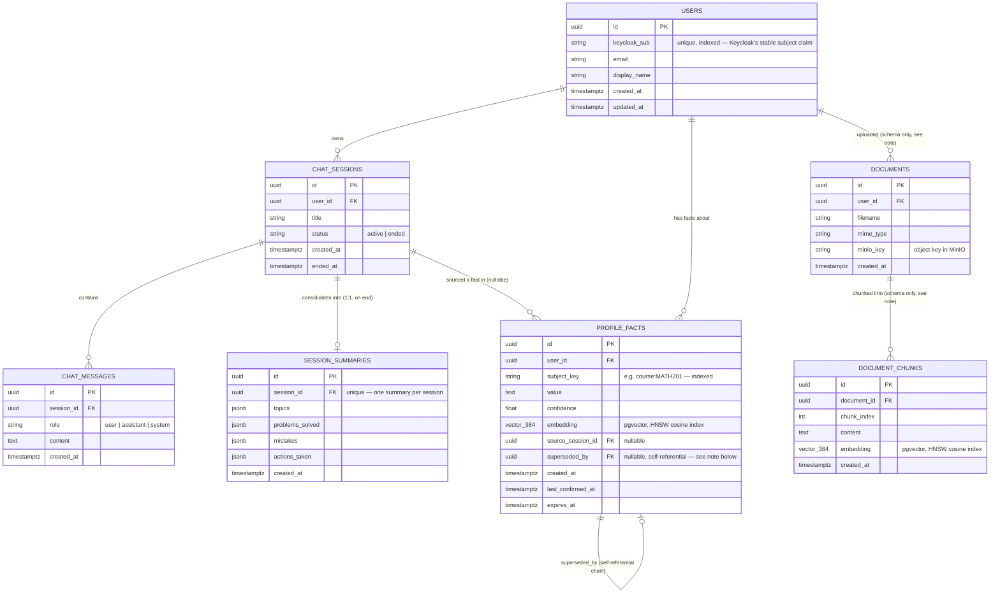

# Newton — Database Schema (ERD)

Source of truth: `services/api/app/db/models.py` (SQLAlchemy models) and
`services/api/migrations/versions/0001_initial.py` (the Alembic migration — this is where the
partial unique index and HNSW vector indexes are actually defined; they aren't visible from the
model classes alone). All seven tables below exist in the schema as of migration `0001`; which
ones are actually read/written by running code is called out per table afterward.

## Entity-relationship diagram



*(`vector_384` is shorthand for pgvector's `vector(384)` type — 384 dimensions, matching the
`fastembed` `BAAI/bge-small-en-v1.5` model used by `services/api/app/memory/embeddings.py`. Mermaid's
`erDiagram` syntax has no native vector type, hence the made-up type name in the diagram.)*

## Table-by-table

### `users`
One row per authenticated student. Created lazily on first request/WS connection via
`get_or_create_user()` (`services/api/app/services/users.py`), keyed on Keycloak's `sub` claim —
there's no separate "signup" step; the first authenticated call to the API provisions the row.

### `chat_sessions`
One conversation. `status` is `active` until `POST /chat/sessions/{id}/end` flips it to `ended`
and stamps `ended_at`, which is also what triggers Tier-2 consolidation (see `jobs/consolidate.py`).

### `chat_messages`
Every user/assistant turn, persisted individually (`role`, `content`) as the WebSocket handler
processes each turn — this is the durable transcript that both the chat-history endpoint and the
consolidation job read from.

### `session_summaries` — Memory Tier 2
One structured JSON summary per ended session (`topics`, `problems_solved`, `mistakes`,
`actions_taken`), written once by the arq `consolidate_session` job. The `session_id` unique index
enforces the 1:1 relationship at the database level, not just by convention.

### `profile_facts` — Memory Tier 3
Typed, cross-session facts about a student (`subject_key` like `course:MATH201` or
`pref:explanation_style`, plus a `value`, `confidence`, and an embedding for retrieval). Two
deliberately "clever" pieces of design here, both defined in the migration rather than being
visible from the model class alone:

1. **Dedup by construction, via a partial unique index.** Migration `0001_initial.py` creates:
   ```sql
   CREATE UNIQUE INDEX ux_profile_facts_current_key
   ON profile_facts (user_id, subject_key)
   WHERE superseded_by IS NULL
   ```
   This means Postgres itself refuses to let two "current" (non-superseded) rows exist for the
   same `(user_id, subject_key)` — it is not just an application convention that write code is
   hoped to respect. `superseded_by` is a nullable self-referential FK to `profile_facts.id`: a
   fact's current value is the row with `superseded_by IS NULL`; updating a fact means inserting a
   new row and pointing the *old* row's `superseded_by` at it, forming a linked chain of
   historical values rather than an overwrite or a plain duplicate. `memory/profile.py`'s
   `upsert_fact()` implements the write side of this and has to work around the index being
   checked immediately (not deferred): when superseding, it briefly points the old row's
   `superseded_by` at *itself* first (so it drops out of the partial index's `WHERE` clause)
   before inserting the real successor, avoiding a moment where two "current" rows would exist and
   violate the index.
2. **pgvector HNSW index on `embedding`**, for approximate-nearest-neighbor cosine search:
   ```sql
   CREATE INDEX ix_profile_facts_embedding ON profile_facts
   USING hnsw (embedding vector_cosine_ops)
   ```
   `memory/profile.py`'s `retrieve_relevant_facts()` uses this for the Tier-3 read path: a small
   top-k cosine-similarity search scoped to the current user and to non-superseded rows, so a
   given chat turn only pulls in the facts relevant to *that* message rather than the student's
   entire profile.

### `documents` and `document_chunks` — schema-only, not yet wired up
Both tables exist (with `document_chunks.embedding` also HNSW-indexed, same purpose: future
document-RAG similarity search) but **there is no code path that writes to them today** — no
upload router, no MinIO write, no chunking, no embedding job. `ROADMAP.md` lists "Document upload
→ MinIO + pgvector → RAG-aware chat" as `!` (not started). They're included in migration `0001`
because the schema was designed up front alongside the rest of Phase 1, per the plan's intent that
document RAG "shouldn't be math-only" bolted on later — but as of this migration, they are inert.

## Actively used vs. schema-only, today

| Table | Status |
|---|---|
| `users` | Active — created/read on every authenticated request |
| `chat_sessions` | Active — created, listed, ended via `/chat/sessions*` |
| `chat_messages` | Active — written on every WS turn, read by `/chat/sessions/{id}/messages` |
| `session_summaries` | Active — written by the `consolidate_session` arq job |
| `profile_facts` | Active — written/read by `memory/profile.py` on every WS turn and by consolidation |
| `documents` | Schema-only — table and FK exist, no code reads or writes it |
| `document_chunks` | Schema-only — table, FK, and HNSW index exist, no code reads or writes it |
