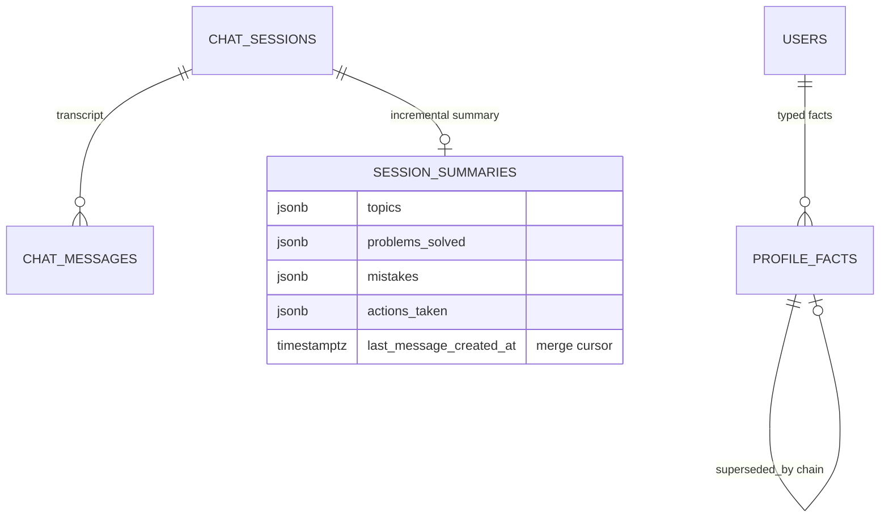
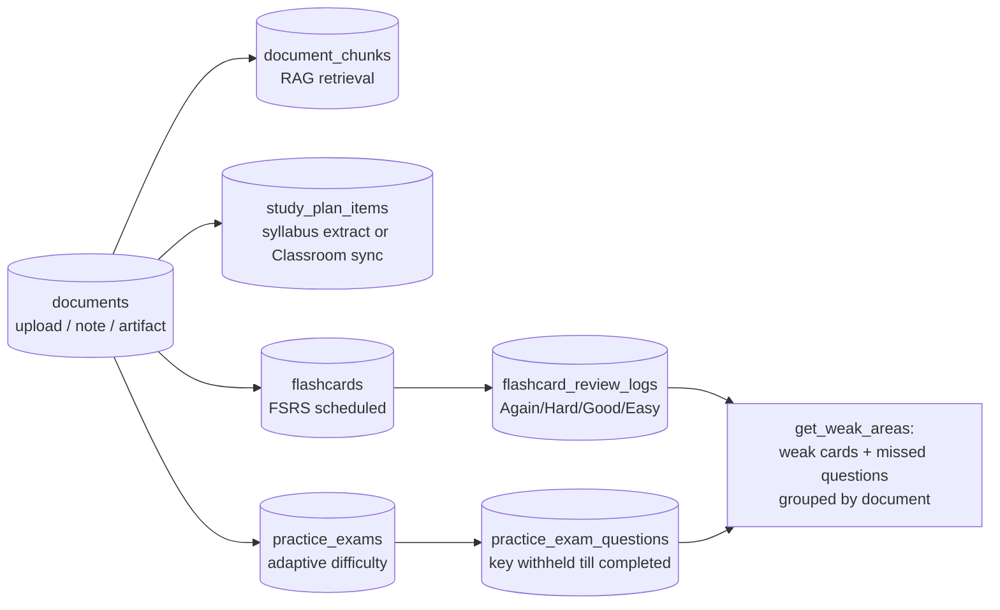
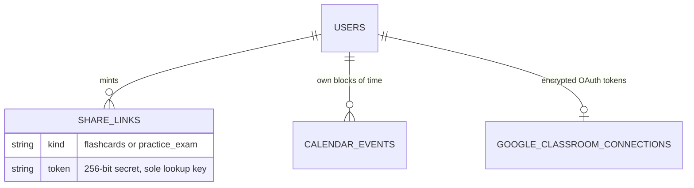

# Newton — Database Schema (ERD)

Source of truth: `services/api/app/db/models.py` (SQLAlchemy models) plus the Alembic
migrations in `services/api/migrations/versions/` — the partial unique index and HNSW vector
indexes live in the migrations, not the model classes. Fifteen tables, migrations
`0001`–`0020`: **all of them are live** (no schema-only tables remain).

> Audit note (2026-09-17): this file previously described 7 tables as of migration `0001` with
> `documents`/`document_chunks` as "schema-only, not yet wired up". Both are live (upload →
> MinIO + chunk + embed → RAG retrieval), and eight more tables have landed since. Rewritten
> against current `models.py`.

*(`vector_384` below is shorthand for pgvector's `vector(384)` — 384 dimensions, matching the
`fastembed` `BAAI/bge-small-en-v1.5` model used by `services/api/app/memory/embeddings.py`.
Mermaid's `erDiagram` syntax has no native vector type, hence the made-up type name.)*

## Entity-relationship diagram (all tables)

```mermaid
erDiagram
    USERS {
        uuid id PK
        string keycloak_sub "unique indexed"
        string email
        string display_name
        string plan "free or pro"
        string stripe_customer_id "nullable indexed"
        string stripe_subscription_id "nullable indexed"
        string stripe_subscription_status "nullable"
        timestamptz current_period_end "nullable"
        int credits_used_cents "frontier spend this period"
        timestamptz credits_period_start "nullable"
        int topup_credits_cents "non-expiring balance"
        string preferred_pro_model "nullable"
        string age_band "nullable under_13/13_17/18_plus"
        timestamptz consented_at "nullable"
        boolean focus_mode_enabled
        boolean learn_mode_enabled
        string calendar_feed_token "nullable secret"
        timestamptz created_at
        timestamptz updated_at
    }

    CHAT_SESSIONS {
        uuid id PK
        uuid user_id FK
        string title "nullable, titling job"
        string status "active or ended"
        timestamptz created_at
        timestamptz ended_at "nullable"
    }

    CHAT_MESSAGES {
        uuid id PK
        uuid session_id FK
        string role "user assistant system"
        text content
        int prompt_tokens "nullable assistant only"
        int completion_tokens "nullable assistant only"
        timestamptz created_at
    }

    SESSION_SUMMARIES {
        uuid id PK
        uuid session_id FK "unique one per session"
        jsonb topics
        jsonb problems_solved
        jsonb mistakes
        jsonb actions_taken
        timestamptz last_message_created_at "nullable incremental cursor"
        timestamptz created_at
    }

    PROFILE_FACTS {
        uuid id PK
        uuid user_id FK
        string subject_key "indexed e.g. course colon MATH201"
        text value
        float confidence
        vector_384 embedding "HNSW cosine index"
        uuid source_session_id FK "nullable SET NULL"
        uuid superseded_by FK "nullable self chain"
        timestamptz created_at
        timestamptz last_confirmed_at
        timestamptz expires_at "nullable"
    }

    DOCUMENTS {
        uuid id PK
        uuid user_id FK
        string filename
        string mime_type "nullable"
        string minio_key
        string kind "upload note artifact"
        jsonb tags "note course tags"
        jsonb paper_sources "nullable paper biblio"
        timestamptz created_at
        timestamptz updated_at
    }

    DOCUMENT_CHUNKS {
        uuid id PK
        uuid document_id FK
        int chunk_index
        text content
        vector_384 embedding "HNSW cosine index"
        timestamptz created_at
    }

    STUDY_PLAN_ITEMS {
        uuid id PK
        uuid user_id FK
        uuid document_id FK "nullable SET NULL"
        string title
        date due_date "nullable"
        string due_date_text "nullable e.g. Week 5"
        text notes "nullable"
        string source "syllabus_upload or classroom"
        string external_id "nullable upsert key"
        timestamptz created_at
    }

    GOOGLE_CLASSROOM_CONNECTIONS {
        uuid id PK
        uuid user_id FK "unique one per user"
        string google_email "nullable"
        text encrypted_access_token
        text encrypted_refresh_token
        timestamptz access_token_expires_at
        text scopes
        timestamptz connected_at
        timestamptz updated_at
    }

    FLASHCARDS {
        uuid id PK
        uuid user_id FK
        uuid document_id FK "nullable SET NULL"
        text front
        text back
        string fsrs_state
        int fsrs_step "nullable"
        float fsrs_stability "nullable"
        float fsrs_difficulty "nullable"
        timestamptz due "indexed"
        timestamptz last_review "nullable"
        timestamptz created_at
    }

    FLASHCARD_REVIEW_LOGS {
        uuid id PK
        uuid flashcard_id FK
        uuid user_id FK
        int rating "1 Again 2 Hard 3 Good 4 Easy"
        timestamptz reviewed_at "indexed"
    }

    PRACTICE_EXAMS {
        uuid id PK
        uuid user_id FK
        uuid document_id FK "nullable SET NULL"
        string title
        string difficulty "easy medium hard"
        float score "nullable until completed"
        timestamptz created_at
        timestamptz completed_at "nullable"
    }

    PRACTICE_EXAM_QUESTIONS {
        uuid id PK
        uuid exam_id FK
        int question_index
        text question
        jsonb choices "4 options"
        int correct_index
        text explanation "nullable"
        int student_answer_index "nullable"
        boolean is_correct "nullable"
    }

    CALENDAR_EVENTS {
        uuid id PK
        uuid user_id FK
        string title
        timestamptz start_at "indexed"
        timestamptz end_at "nullable"
        text notes "nullable"
        timestamptz created_at
        timestamptz updated_at
    }

    SHARE_LINKS {
        uuid id PK
        uuid user_id FK
        string kind "flashcards or practice_exam"
        uuid document_id FK "nullable CASCADE"
        uuid exam_id FK "nullable CASCADE"
        string token "unique indexed secret"
        timestamptz created_at
    }

    USERS ||--o{ CHAT_SESSIONS : "owns"
    CHAT_SESSIONS ||--o{ CHAT_MESSAGES : "contains"
    CHAT_SESSIONS ||--o| SESSION_SUMMARIES : "summarized as 1 to 1"
    USERS ||--o{ PROFILE_FACTS : "has facts about"
    CHAT_SESSIONS ||--o{ PROFILE_FACTS : "sourced fact nullable"
    PROFILE_FACTS ||--o| PROFILE_FACTS : "superseded_by self chain"
    USERS ||--o{ DOCUMENTS : "uploads notes artifacts"
    DOCUMENTS ||--o{ DOCUMENT_CHUNKS : "chunked into"
    USERS ||--o{ STUDY_PLAN_ITEMS : "tracks"
    DOCUMENTS ||--o{ STUDY_PLAN_ITEMS : "extracted from nullable"
    USERS ||--o| GOOGLE_CLASSROOM_CONNECTIONS : "connects 1 to 1"
    USERS ||--o{ FLASHCARDS : "owns"
    DOCUMENTS ||--o{ FLASHCARDS : "generated from nullable"
    FLASHCARDS ||--o{ FLASHCARD_REVIEW_LOGS : "reviewed in"
    USERS ||--o{ PRACTICE_EXAMS : "takes"
    DOCUMENTS ||--o{ PRACTICE_EXAMS : "generated from nullable"
    PRACTICE_EXAMS ||--o{ PRACTICE_EXAM_QUESTIONS : "contains"
    USERS ||--o{ CALENDAR_EVENTS : "schedules"
    USERS ||--o{ SHARE_LINKS : "shares"
    DOCUMENTS ||--o{ SHARE_LINKS : "deck scope nullable"
    PRACTICE_EXAMS ||--o{ SHARE_LINKS : "exam scope nullable"
```

## Focused views

### Chat + memory (Tier 2 / Tier 3)

`consolidate_session` reads only messages newer than `last_message_created_at` and UPDATEs the
row in place (one row per session, `session_id` unique) — a repeat run merges, never appends.
Tier-3 writes go through `upsert_fact()`: same `(user_id, subject_key)` reconfirms in place,
a changed value inserts a successor and points the old row's `superseded_by` at it. The partial
unique index `ux_profile_facts_current_key ON (user_id, subject_key) WHERE superseded_by IS
NULL` makes Postgres itself refuse two current rows per key. Retrieval is top-k HNSW cosine
search over non-superseded rows for the current user only.

### Study domain (documents → materials → performance)

`document_id` on study materials is `ON DELETE SET NULL`: deleting a source document keeps the
generated items (they survive their source). `document_chunks.document_id` is instead
`ON DELETE CASCADE` (chunks are meaningless without their document). Difficulty per exam comes
from the mean of the last 3 completed scores; `get_weak_areas` flags a card when a majority of
its last 3 reviews are Again/Hard.

### Sharing, calendar, integrations

Share links are public-by-token (`GET /s/{token}`, no auth router) and revoked by row DELETE,
not a flag. `calendar_events` are hand-typed time blocks, deliberately separate from
`study_plan_items` (deadlines with `due_date`/`due_date_text`); the ICS feed merges both.
Classroom tokens are Fernet-encrypted at rest; re-sync upserts study items by `external_id`.

## Table-by-table

### `users`
One row per authenticated student, JIT-provisioned by `get_or_create_user()` from Keycloak's
`sub` claim — no separate signup step. Billing columns (`plan`, `stripe_*`,
`credits_used_cents`, `topup_credits_cents`, `preferred_pro_model`), consent columns
(`age_band`, `consented_at`), pedagogy toggles (`focus_mode_enabled`, `learn_mode_enabled`),
and the lazily-minted `calendar_feed_token` (only for users who request an ICS URL; regenerated
to revoke leaks). Cascades: deleting a user removes sessions, messages (via sessions),
documents (+ chunks transitively), study items, Classroom connection, flashcards (+ review
logs), exams (+ questions via exams), calendar events, share links, and profile facts
(migrations `0010`/`0011`).

### `chat_sessions`
One conversation. `status` flips `active` → `ended` on explicit end; `title` is filled once by
the `generate_session_title` job after the 2nd assistant reply. Retention reporting keys off
the newest `created_at` per user (falling back to `users.created_at`).

### `chat_messages`
Every turn persisted individually. Assistant rows carry the turn's real `prompt_tokens` /
`completion_tokens` (migration `0009`) for the per-chat running total; crisis replies store
`NULL` usage. This table is the durable transcript consolidation reads and the Tier-1 bundle
rehydrates from on cold cache.

### `session_summaries` — Memory Tier 2
One row per session (`session_id` unique), UPDATE-merged by each consolidation run with the
`last_message_created_at` cursor (migration `0020`) bounding reads to what's new. Fields:
`topics`, `problems_solved`, `mistakes`, `actions_taken`.

### `profile_facts` — Memory Tier 3
Typed cross-session facts (`subject_key` like `course:MATH201`, `skill:derivatives`,
`pref:explanation_style`) with `value`, `confidence`, HNSW-indexed `embedding`,
nullable `source_session_id` (`SET NULL` on session delete — the audit-trail pointer never
blocks deletion), and the `superseded_by` self-chain. See the dedup/ANN notes under the memory
view above; full SQL in migration `0001`.

### `documents` and `document_chunks` — live RAG
`documents` holds uploads, Notepad notes (`kind=note`, grown via `PATCH /notes`), generated
paper PDF/TEX (with `paper_sources` JSONB powering `.bib` download), and artifact HTML
(`kind=artifact`). `tags` are user-set course labels for notes. `document_chunks` holds the
chunk + 384d embedding rows with their own HNSW index. Both are written on every upload and
read on every chat turn (top-k, user-scoped) — the old "schema-only" label was stale.

### `study_plan_items`
Deadlines from syllabus extraction (`source=syllabus_upload`) or Classroom sync
(`source=classroom`, `external_id` = Classroom courseWork id for upsert). `due_date_text`
preserves the model's original wording ("Week 5") when no exact date exists instead of
guessing one.

### `google_classroom_connections`
One row per connected user (`user_id` unique): encrypted access/refresh tokens, expiry, scopes.
A separate app-managed OAuth grant from Keycloak-brokered Google *login*.

### `flashcards` and `flashcard_review_logs`
FSRS state lives on the card (`fsrs_state/step/stability/difficulty`, `due`, `last_review`);
the log is the append-only audit trail FSRS doesn't keep (one row per review, `rating` 1–4)
and the raw material for streaks/XP and weak-area analysis.

### `practice_exams` and `practice_exam_questions`
`score`/`completed_at` stay null until submission; the answer key (`correct_index`,
`explanation`) is never sent before completion. `student_answer_index`/`is_correct` record the
graded outcome per question.

### `calendar_events`
Hand-typed blocks (`start_at`, nullable `end_at`), merged with study items only in the ICS feed.

### `share_links`
Unguessable token links (`kind` + nullable `document_id`/`exam_id`, each `CASCADE` so deleting
the target kills its links). lookup is by token alone, hence `unique + index`.

## Live status (all active)

| Table | Status |
|---|---|
| `users` | Active — auth, billing, consent, toggles, feed token |
| `chat_sessions` | Active — create/list/end/delete, titling target |
| `chat_messages` | Active — per-turn transcript + token usage |
| `session_summaries` | Active — incremental consolidation target |
| `profile_facts` | Active — Tier-3 write/read every turn + consolidation |
| `documents` | Active — uploads, notes, papers, artifacts |
| `document_chunks` | Active — chunk/embed store, per-turn RAG retrieval |
| `study_plan_items` | Active — syllabus extraction + Classroom sync |
| `google_classroom_connections` | Active — connect/sync, encrypted tokens |
| `flashcards` | Active — generation + FSRS review |
| `flashcard_review_logs` | Active — review trail, streaks, weak areas |
| `practice_exams` | Active — adaptive generation + grading |
| `practice_exam_questions` | Active — questions, answers, grading |
| `calendar_events` | Active — hand calendar + ICS feed |
| `share_links` | Active — public deck/exam links |
