# Newton — AI Tools Reference

Source of truth: `services/api/app/tools/registry.py` (`_TOOLS`, `CORE_TOOL_NAMES`, `_ON_DEMAND_GROUPS`), `services/api/app/agents/tutor.py` (`run_tutor`, `SYSTEM_PROMPT`), and each `services/api/app/tools/*.py` module. No code was changed to write this document.

Related: [`architecture.md`](./architecture.md) (system topology + chat-turn sequence), [`erd.md`](./erd.md) (full DB schema), [`data-retention-and-privacy.md`](./data-retention-and-privacy.md).

## Tool belt at a glance

22 registered tools + 1 meta-tool (`use_capability`) + 2 voice service clients (not LLM-callable).

| Tool (`name`) | File | Route | Cost / gate |
|---|---|---|---|
| `calculator` | `tools/calculator.py` | core (always loaded) | free, local, deterministic |
| `unit_converter` | `tools/unit_converter.py` | core | free, local, deterministic |
| `symbolic_math` | `tools/symbolic_math.py` | core | free, local SymPy |
| `web_search` | `tools/web_search.py` | core | free, self-hosted SearXNG |
| `use_capability` | `tools/registry.py` + `agents/tutor.py` | core meta-tool, loads on-demand tools | free, no I/O |
| `read_image` | `tools/vision.py` | deterministic exception (loaded only when message matches `\[Attached image: ...\]`) | needs OpenRouter key + vision model |
| `plot_function` | `tools/visualizer.py` | on-demand | free, local SymPy+numpy |
| `code_interpreter` | `tools/code_interpreter.py` | on-demand | free, `sandbox-runner` service |
| `research_fetch` | `tools/research_fetch.py` | on-demand | free, allowlisted HTTPS fetch, 15 calls/session |
| `textbook_lookup` | `tools/textbook_lookup.py` | on-demand | free, Open Library API |
| `grammar_check` | `tools/grammar_check.py` | on-demand | free, self-hosted LanguageTool |
| `format_citation` | `tools/citation.py` | on-demand | free, local, deterministic |
| `generate_flashcards` | `tools/flashcard_generation.py` | on-demand | free (5 free / 15 Pro items per call), writes DB |
| `generate_practice_exam` | `tools/practice_exam_generation.py` | on-demand | free (same 5/15 target), writes DB |
| `generate_study_plan` | `tools/study_plan_generation.py` | on-demand | free, writes DB |
| `start_study_session` | `tools/study_session.py` | on-demand | **Pro-only**, writes all three above concurrently |
| `sync_google_classroom` | `tools/classroom_sync.py` | on-demand | free, needs connected Classroom OAuth |
| `check_student_work` | `tools/check_work.py` | on-demand | free, local SymPy verification |
| `check_code_work` | `tools/check_code_work.py` | on-demand | free, `sandbox-runner` service (`POST /run-code`) |
| `get_weak_areas` | `tools/get_weak_areas.py` | on-demand | free, reads real performance tables |
| `get_math_hint` | `tools/math_hint.py` | on-demand | free, local SymPy-grounded hints |
| `write_research_paper` | `tools/write_research_paper.py` | on-demand | **Pro-only + Focus-Mode-blocked**, most expensive (search+fetch+provider calls per section + LaTeX compile) |
| `create_artifact` | `tools/create_artifact.py` | on-demand | **Pro-only + Focus-Mode-blocked + credit-metered**, most expensive single action (persona call + agentic coding run) |
| `voice_stt` / `voice_tts` | `tools/voice_stt.py` / `tools/voice_tts.py` | **not** registry tools; plain service clients for `POST /voice/transcribe` and `POST /voice/synthesize` | **Pro-only** at router level, self-hosted whisper-asr / piper-tts |

## 0. How the Tutor loads and runs tools

Every turn starts with the same small list (token-cheap): the 4 core specs + `use_capability`. Everything else is loaded on demand, and `read_image` bypasses `use_capability` entirely because its trigger is deterministic.

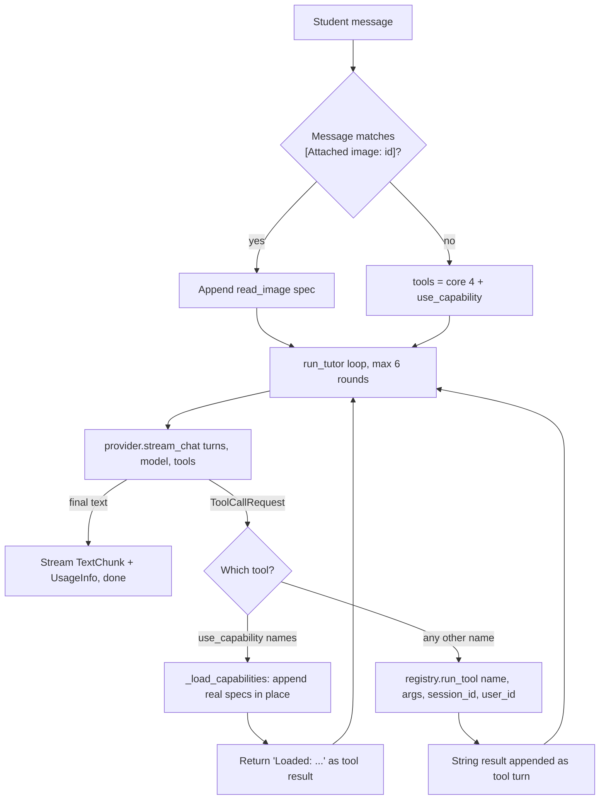
```mermaid
flowchart TD
    U["Student message"] --> IMG{"Message matches<br/>[Attached image: id]?"}
    IMG -- yes --> ADDIMG["Append read_image spec"]
    IMG -- no --> CORE["tools = core 4 + use_capability"]
    ADDIMG --> LOOP
    CORE --> LOOP["run_tutor loop, max 6 rounds"]
    LOOP --> CALL["provider.stream_chat turns, model, tools"]
    CALL -- "final text" --> ANS["Stream TextChunk + UsageInfo, done"]
    CALL -- "ToolCallRequest" --> WHICH{"Which tool?"}
    WHICH -- "use_capability names" --> LOAD["_load_capabilities: append real specs in place"]
    LOAD --> FEEDBACK["Return 'Loaded: ...' as tool result"]
    FEEDBACK --> LOOP
    WHICH -- "any other name" --> RUN["registry.run_tool name, args, session_id, user_id"]
    RUN --> RES["String result appended as tool turn"]
    RES --> LOOP
```

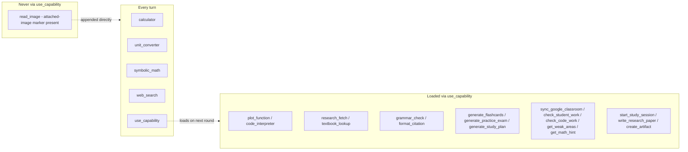
```mermaid
flowchart LR
    subgraph Core["Every turn"]
        C1["calculator"]
        C2["unit_converter"]
        C3["symbolic_math"]
        C4["web_search"]
        META["use_capability"]
    end
    subgraph OnDemand["Loaded via use_capability"]
        O1["plot_function / code_interpreter"]
        O2["research_fetch / textbook_lookup"]
        O3["grammar_check / format_citation"]
        O4["generate_flashcards / generate_practice_exam / generate_study_plan"]
        O5["sync_google_classroom / check_student_work / check_code_work / get_weak_areas / get_math_hint"]
        O6["start_study_session / write_research_paper / create_artifact"]
    end
    subgraph Deterministic["Never via use_capability"]
        D1["read_image - attached-image marker present"]
    end
    META -. "loads on next round" .-> OnDemand
    D1 -. "appended directly" .-> Core
```

Tool-result contract (from `tools/base.py` + `registry.run_tool`): every `run()` returns a string; failures are `"Error: ..."` / `"Search failed: ..."` strings, never an exception past the registry, so the model can react instead of the turn crashing. Context injection (`session_id`, `user_id`) is caller-supplied and never model-controlled.

---

## 1. `calculator` — exact arithmetic

Pure local function. AST-restricted evaluation (literals, `+ - * / // % **`, parens, unary `+/-` only); deliberately not `eval()`, so a model-controlled string cannot reach code execution.

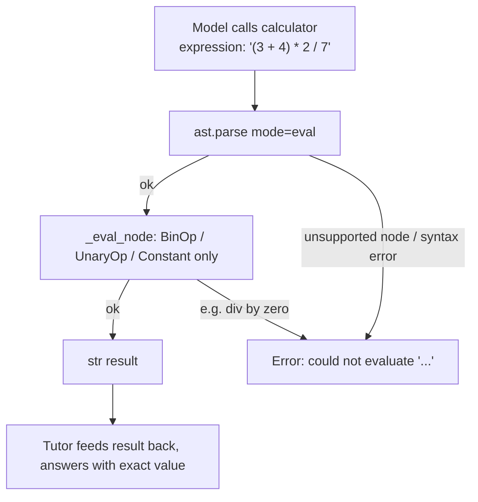
```mermaid
flowchart TD
    M["Model calls calculator\nexpression: '(3 + 4) * 2 / 7'"] --> PARSE["ast.parse mode=eval"]
    PARSE -- ok --> WALK["_eval_node: BinOp / UnaryOp / Constant only"]
    WALK -- ok --> STR["str result"]
    PARSE -- "unsupported node / syntax error" --> ERR["Error: could not evaluate '...'"]
    WALK -- "e.g. div by zero" --> ERR
    STR --> TUTOR["Tutor feeds result back, answers with exact value"]
```

## 2. `unit_converter` — deterministic unit conversion

Pure local function. Multiplicative tables (length/mass/volume) convert via base unit; temperature routes through Celsius. Cross-dimension requests (kg → m, temperature ↔ non-temperature) are errors, never silent guesses.

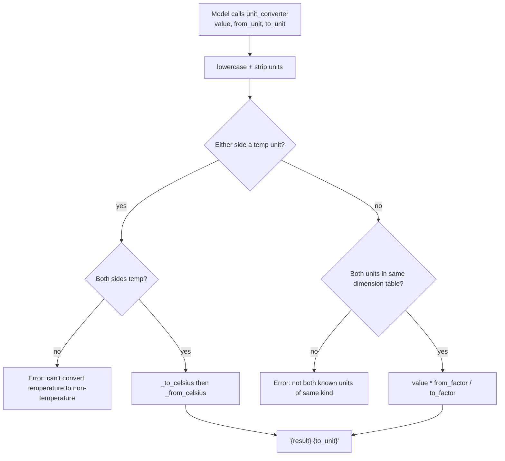
```mermaid
flowchart TD
    M["Model calls unit_converter\nvalue, from_unit, to_unit"] --> NORM["lowercase + strip units"]
    NORM --> TEMP{"Either side a temp unit?"}
    TEMP -- yes --> BOTH{"Both sides temp?"}
    BOTH -- no --> ERR1["Error: can't convert temperature to non-temperature"]
    BOTH -- yes --> C["_to_celsius then _from_celsius"]
    TEMP -- no --> DIM{"Both units in same dimension table?"}
    DIM -- no --> ERR2["Error: not both known units of same kind"]
    DIM -- yes --> MUL["value * from_factor / to_factor"]
    C --> OUT["'{result} {to_unit}'"]
    MUL --> OUT
```

Supported units: length `m km cm mm mi ft in yd`; mass `kg g mg lb oz`; volume `l ml gal qt cup`; temperature `c f k`.

## 3. `symbolic_math` — SymPy exact math

Local SymPy. Parses natural math (`^` = power, `2x` = `2*x` via `convert_xor` + implicit multiplication). Operations: `simplify solve differentiate integrate factor expand`. `solve` splits a single `=` into `lhs - rhs`. The Tutor's contract: call this first for any step-by-step derivation, then narrate a `math-steps` fenced block ending with this tool's actual answer.

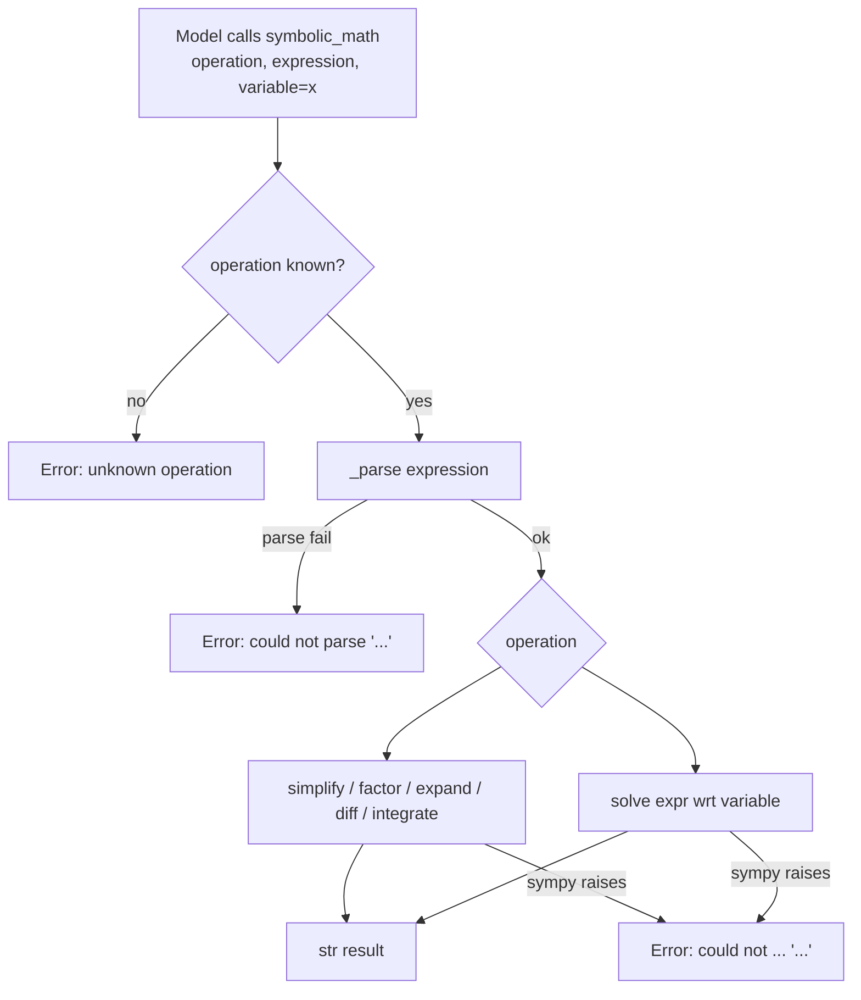
```mermaid
flowchart TD
    M["Model calls symbolic_math\noperation, expression, variable=x"] --> OP{"operation known?"}
    OP -- no --> ERR1["Error: unknown operation"]
    OP -- yes --> PARSE["_parse expression"]
    PARSE -- "parse fail" --> ERR2["Error: could not parse '...'"]
    PARSE -- ok --> DISP{"operation"}
    DISP --> SIMP["simplify / factor / expand / diff / integrate"]
    DISP --> SOLVE["solve expr wrt variable"]
    SIMP --> RET["str result"]
    SOLVE --> RET
    SIMP -- "sympy raises" --> ERR3["Error: could not ... '...'"]
    SOLVE -- "sympy raises" --> ERR3
```

## 4. `plot_function` — visualizer

Local numeric sampling (SymPy `lambdify` + numpy). Non-finite points (div-by-zero, sqrt of negative) are dropped so discontinuities render as gaps. Returns a `plotly-figure` fenced block the frontend renders; the model must relay it verbatim, never describe the shape in words. Optional `vary` (Learn Mode only) builds one trace per slider position plus a `sliders` descriptor so dragging never needs a new network call.

```mermaid
flowchart TD
    M["Model calls plot_function\nexpression, variable, x_min, x_max, vary?"] --> VAL["Validate range + num_points 2-5000"]
    VAL -- invalid --> ERR["Error: ..."]
    VAL -- ok --> PARSE["parse_expr"]
    PARSE -- fail --> ERR
    PARSE -- ok --> VARY{"vary present?"}
    VARY -- no --> CHECK1["free_symbols == variable?"]
    CHECK1 -- no --> ERR
    CHECK1 -- yes --> S1["lambdify + sample 200 pts, drop non-finite"]
    S1 -- "all non-finite" --> ERR
    S1 -- ok --> FIG1["{type: plotly_figure, data: 1 trace, layout}"]
    VARY -- yes --> CHECK2["vary.symbol != variable, steps 2-11, symbols subset"]
    CHECK2 -- no --> ERR
    CHECK2 -- yes --> LOOPV["Per vary value: subs + lambdify + sample"]
    LOOPV --> FIG2["{data: N traces 1 visible, layout, sliders}"]
    FIG1 --> FENCE["```plotly-figure JSON ```"]
    FIG2 --> FENCE
```

## 5. `code_interpreter` — sandboxed Python

Thin HTTP client over `sandbox-runner` (`POST /execute`, 20s client timeout vs ~10s sandbox watchdog). Sandbox is non-root, dropped capabilities, read-only FS, rlimits + wall-clock watchdog, no network, no state between requests. Returns exit code + timed-out flag + stdout/stderr sections.

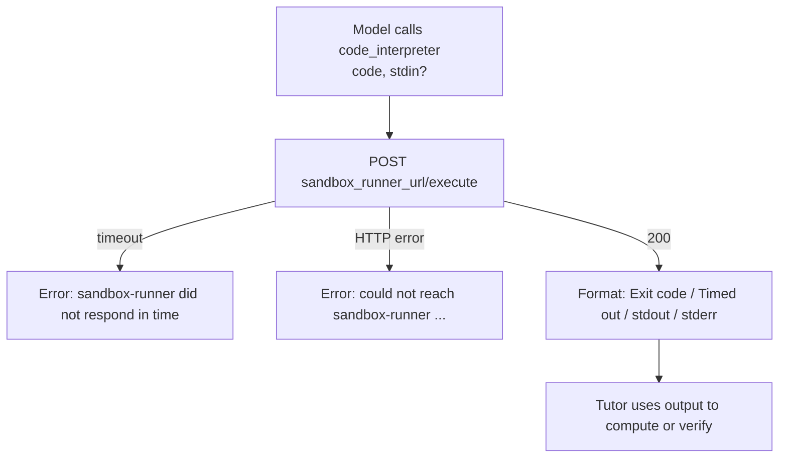
```mermaid
flowchart TD
    M["Model calls code_interpreter\ncode, stdin?"] --> POST["POST sandbox_runner_url/execute"]
    POST -- timeout --> ERR1["Error: sandbox-runner did not respond in time"]
    POST -- "HTTP error" --> ERR2["Error: could not reach sandbox-runner ..."]
    POST -- 200 --> FMT["Format: Exit code / Timed out / stdout / stderr"]
    FMT --> TUTOR["Tutor uses output to compute or verify"]
```

## 6. `web_search` — SearXNG metasearch

Self-hosted SearXNG (`GET /search?q=...&format=json`). Skips entries missing title or URL; truncates snippets at 300 chars; caps `num_results` at 1–10 (default 5). Never raises: upstream failure, empty usable results, and parse failure all return a `"Search failed: ..."` string the loop can react to.

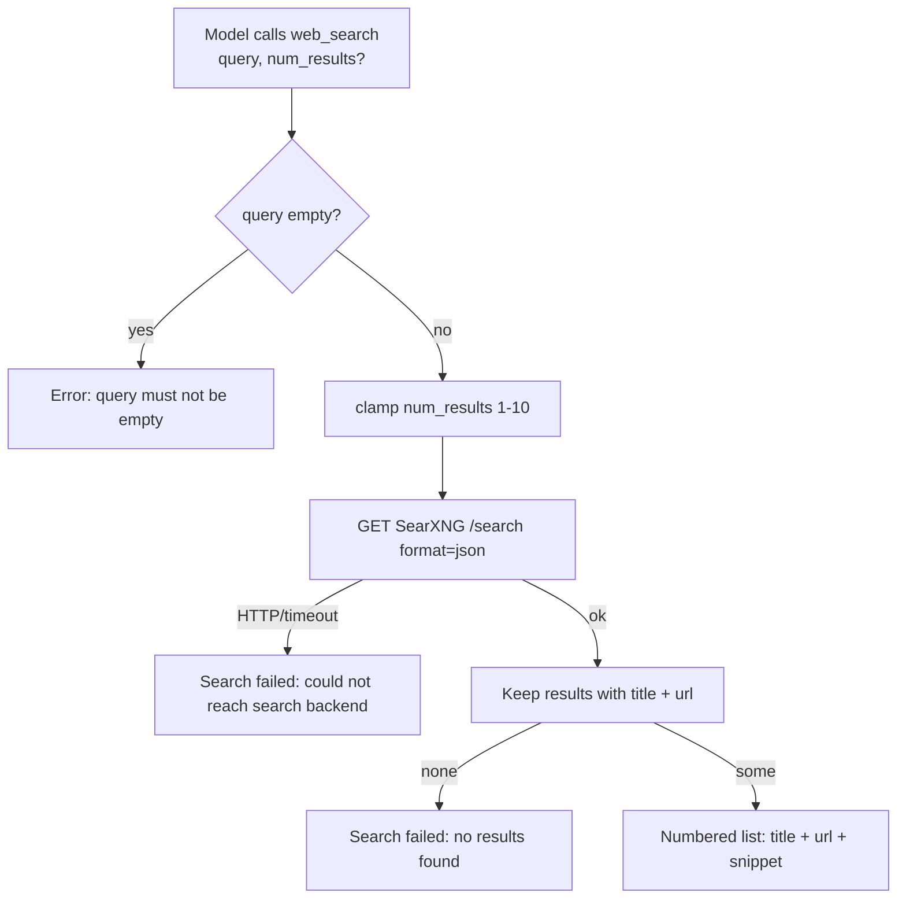
```mermaid
flowchart TD
    M["Model calls web_search\nquery, num_results?"] --> EMPTY{"query empty?"}
    EMPTY -- yes --> ERR["Error: query must not be empty"]
    EMPTY -- no --> CLAMP["clamp num_results 1-10"]
    CLAMP --> GET["GET SearXNG /search format=json"]
    GET -- "HTTP/timeout" --> FAIL["Search failed: could not reach search backend"]
    GET -- ok --> FILTER["Keep results with title + url"]
    FILTER -- none --> FAIL2["Search failed: no results found"]
    FILTER -- some --> FMT["Numbered list: title + url + snippet"]
```

## 7. `research_fetch` — allowlisted full-text fetch

Highest-risk tool; 10 layered defenses (see module docstring): curated domain allowlist (arxiv.org, PubMed/PMC, doi.org, Wikipedia, Semantic Scholar, PLOS, `*.edu`), SSRF + DNS-rebinding defense (resolve once, reject private/loopback/link-local/multicast/reserved/unspecified, connect to validated IP with original `Host`/SNI), https-only, no auto-redirect (each hop re-validated, max 3), 10s timeout + 3MB streamed cap, content-type allowlist (html/plain/pdf), stdlib-only extraction, `[UNTRUSTED EXTERNAL CONTENT]` banner, 15-calls/session Redis rate limit, full audit logging. `run()` is the LLM text contract; `fetch()` is the lower-level entry returning `FetchResult(text, truncated, metadata)` with real `citation_*`/`DC.*` meta tags for `write_research_paper`'s citation verification.

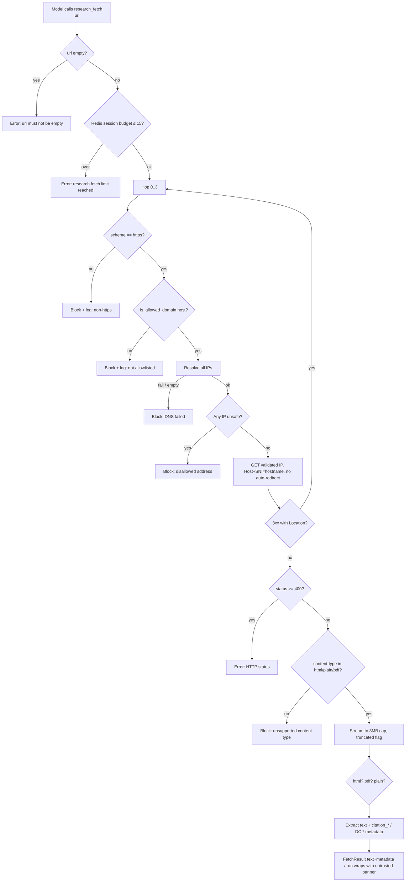
```mermaid
flowchart TD
    M["Model calls research_fetch\nurl"] --> EMPTY{"url empty?"}
    EMPTY -- yes --> ERR0["Error: url must not be empty"]
    EMPTY -- no --> RL{"Redis session budget ≤ 15?"}
    RL -- over --> ERR1["Error: research fetch limit reached"]
    RL -- ok --> LOOP["Hop 0..3"]
    LOOP --> SCHEME{"scheme == https?"}
    SCHEME -- no --> BLOCK1["Block + log: non-https"]
    SCHEME -- yes --> ALLOW{"is_allowed_domain host?"}
    ALLOW -- no --> BLOCK2["Block + log: not allowlisted"]
    ALLOW -- yes --> DNS["Resolve all IPs"]
    DNS -- "fail / empty" --> BLOCK3["Block: DNS failed"]
    DNS -- ok --> SAFE{"Any IP unsafe?"}
    SAFE -- yes --> BLOCK4["Block: disallowed address"]
    SAFE -- no --> FETCH["GET validated IP, Host+SNI=hostname, no auto-redirect"]
    FETCH --> REDIR{"3xx with Location?"}
    REDIR -- yes --> LOOP
    REDIR -- no --> HTTP{"status >= 400?"}
    HTTP -- yes --> ERRH["Error: HTTP status"]
    HTTP -- no --> CT{"content-type in html/plain/pdf?"}
    CT -- no --> BLOCK5["Block: unsupported content type"]
    CT -- yes --> STREAM["Stream to 3MB cap, truncated flag"]
    STREAM --> EXTRACT{"html? pdf? plain?"}
    EXTRACT --> META["Extract text + citation_* / DC.* metadata"]
    META --> OK["FetchResult text+metadata / run wraps with untrusted banner"]
```

## 8. `textbook_lookup` — Open Library metadata

Free, keyless Open Library API. Metadata only (title/authors/subjects/table of contents), never full copyrighted text. `no_textbook=true` is a first-class success path for courses with no assigned book. ISBN path uses `/api/books`; title/author path uses `/search.json` (top 3).

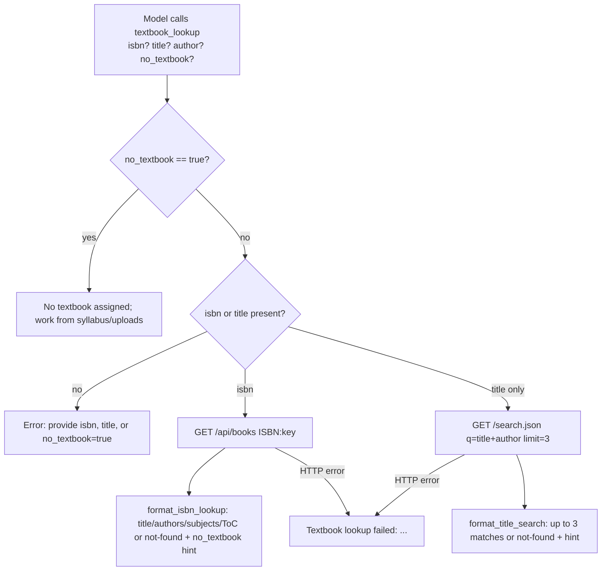
```mermaid
flowchart TD
    M["Model calls textbook_lookup\nisbn? title? author? no_textbook?"] --> NONE{"no_textbook == true?"}
    NONE -- yes --> OK1["No textbook assigned; work from syllabus/uploads"]
    NONE -- no --> HAVE{"isbn or title present?"}
    HAVE -- no --> ERR["Error: provide isbn, title, or no_textbook=true"]
    HAVE -- isbn --> ISBN["GET /api/books ISBN:key"]
    HAVE -- "title only" --> SEARCH["GET /search.json q=title+author limit=3"]
    ISBN --> FMT1["format_isbn_lookup: title/authors/subjects/ToC or not-found + no_textbook hint"]
    SEARCH --> FMT2["format_title_search: up to 3 matches or not-found + hint"]
    ISBN -- "HTTP error" --> FAIL["Textbook lookup failed: ..."]
    SEARCH -- "HTTP error" --> FAIL
```

## 9. `read_image` (`VisionTool`) — capture-to-solve

Standalone multimodal call; deliberately not part of core text-only provider plumbing. Flow: Composer upload → MinIO object + short-lived Redis session pointer → `[Attached image: <id>]` marker in message → Tutor deterministically appends `read_image` spec (never via `use_capability`) → tool resolves bytes via `images.get_image_for_session`, base64s into an OpenRouter vision chat call, returns transcription + solution. Requires `OPENROUTER_API_KEY` and a configured vision model.

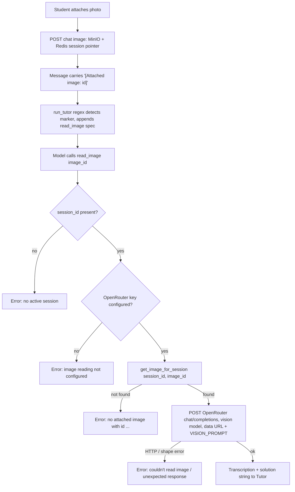
```mermaid
flowchart TD
    S["Student attaches photo"] --> UP["POST chat image: MinIO + Redis session pointer"]
    UP --> MARK["Message carries '[Attached image: id]'"]
    MARK --> TUTOR["run_tutor regex detects marker, appends read_image spec"]
    TUTOR --> CALL["Model calls read_image image_id"]
    CALL --> SESS{"session_id present?"}
    SESS -- no --> ERR1["Error: no active session"]
    SESS -- yes --> KEY{"OpenRouter key configured?"}
    KEY -- no --> ERR2["Error: image reading not configured"]
    KEY -- yes --> LOOK["get_image_for_session session_id, image_id"]
    LOOK -- "not found" --> ERR3["Error: no attached image with id ..."]
    LOOK -- found --> VISION["POST OpenRouter chat/completions, vision model, data URL + VISION_PROMPT"]
    VISION -- "HTTP / shape error" --> ERR4["Error: couldn't read image / unexpected response"]
    VISION -- ok --> TEXT["Transcription + solution string to Tutor"]
```

## 10. `grammar_check` — LanguageTool

Self-hosted LanguageTool (`POST /v2/check`). Pure `format_matches` turns the `matches` array into a numbered list (flagged text, message, up-to-3 suggestions, ±30-char context), capped at 15 shown. Empty text and upstream/parse failures return clear error strings, never raise.

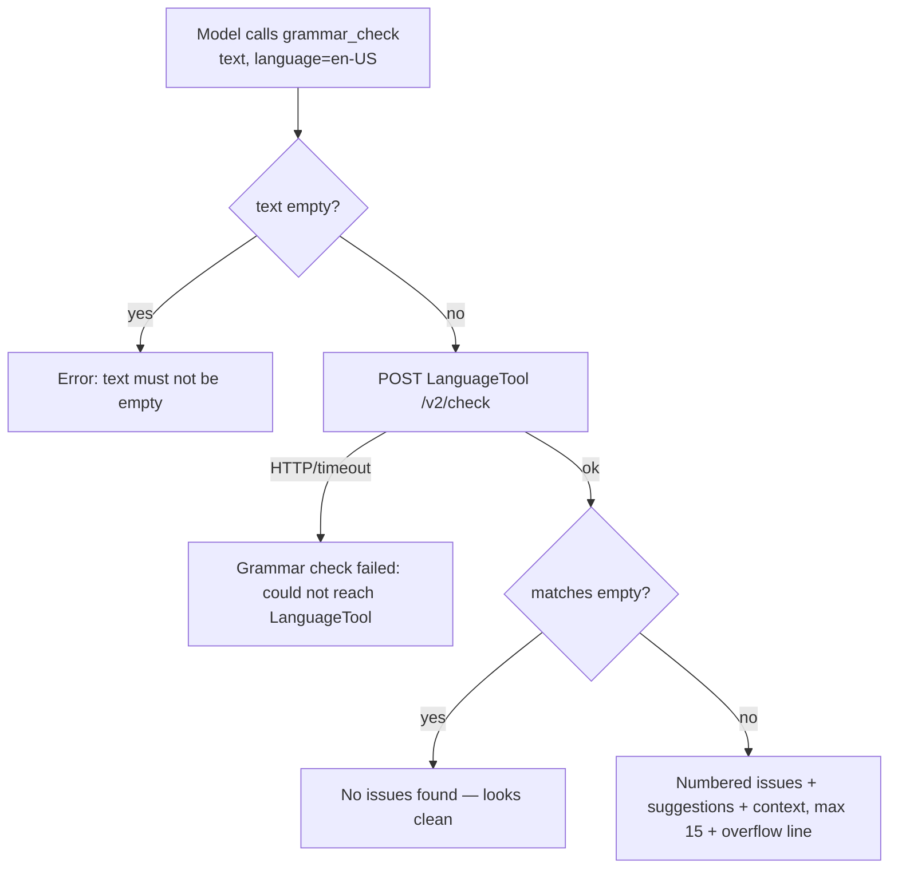
```mermaid
flowchart TD
    M["Model calls grammar_check\ntext, language=en-US"] --> EMPTY{"text empty?"}
    EMPTY -- yes --> ERR["Error: text must not be empty"]
    EMPTY -- no --> POST["POST LanguageTool /v2/check"]
    POST -- "HTTP/timeout" --> FAIL["Grammar check failed: could not reach LanguageTool"]
    POST -- ok --> NOMATCH{"matches empty?"}
    NOMATCH -- yes --> CLEAN["No issues found — looks clean"]
    NOMATCH -- no --> FMT["Numbered issues + suggestions + context, max 15 + overflow line"]
```

## 11. `format_citation` — deterministic citations

Pure local formatter (no model call, so output is exact and reproducible). Styles APA/MLA/Chicago-author-date; types book (publisher) / journal_article (journal/volume/issue/pages) / website (site_name/url). 3+ authors collapse to first + `et al.` (documented simplification vs full APA-7 20-author rule).

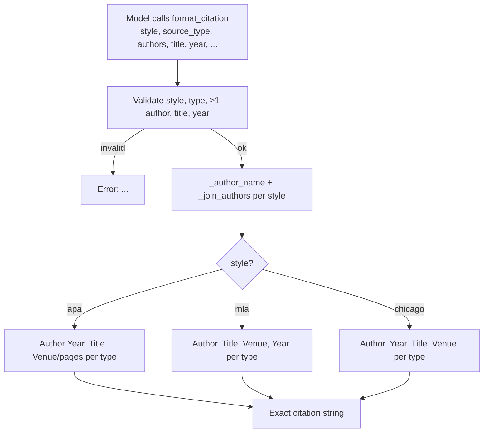
```mermaid
flowchart TD
    M["Model calls format_citation\nstyle, source_type, authors, title, year, ..."] --> VAL["Validate style, type, ≥1 author, title, year"]
    VAL -- invalid --> ERR["Error: ..."]
    VAL -- ok --> NAMES["_author_name + _join_authors per style"]
    NAMES --> STYLE{"style?"}
    STYLE -- apa --> APA["Author Year. Title. Venue/pages per type"]
    STYLE -- mla --> MLA["Author. Title. Venue, Year per type"]
    STYLE -- chicago --> CHI["Author. Year. Title. Venue per type"]
    APA --> OUT["Exact citation string"]
    MLA --> OUT
    CHI --> OUT
```

## 12–14. Document-grounded generation trio

All three share one helper (`tools/document_resolution.py: resolve_document`): optional filename substring (`ILIKE %hint%`), else most recent upload, always scoped to the calling user. All write real rows the panels read; the model must call the tool, never emit flashcard/quiz/plan-shaped text. Free/Pro difference is count-per-call (`FREE_GENERATION_TARGET` 5 vs `PRO_GENERATION_TARGET` 15), never a time-based cap.

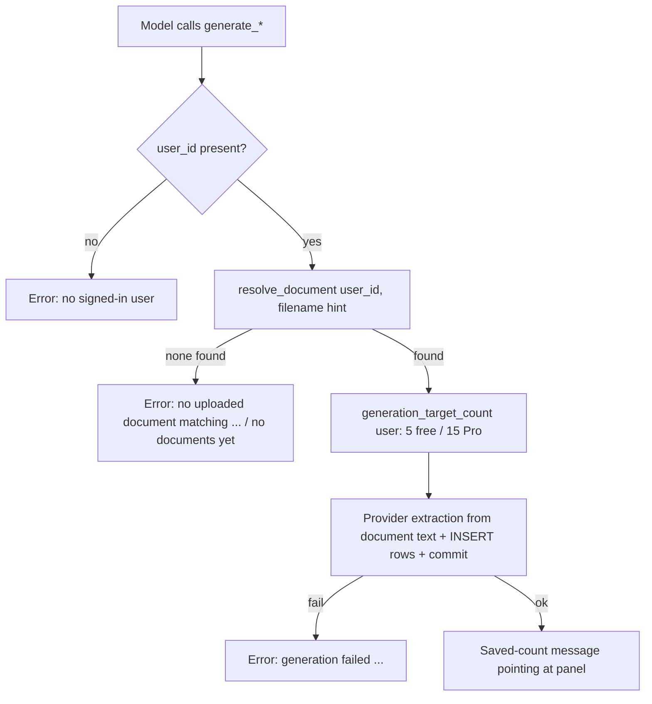
```mermaid
flowchart TD
    M["Model calls generate_*"] --> CTX{"user_id present?"}
    CTX -- no --> ERR0["Error: no signed-in user"]
    CTX -- yes --> RES["resolve_document user_id, filename hint"]
    RES -- "none found" --> ERR1["Error: no uploaded document matching ... / no documents yet"]
    RES -- found --> TARGET["generation_target_count user: 5 free / 15 Pro"]
    TARGET --> GEN["Provider extraction from document text + INSERT rows + commit"]
    GEN -- fail --> ERR2["Error: generation failed ..."]
    GEN -- ok --> MSG["Saved-count message pointing at panel"]
```

### 12. `generate_flashcards`

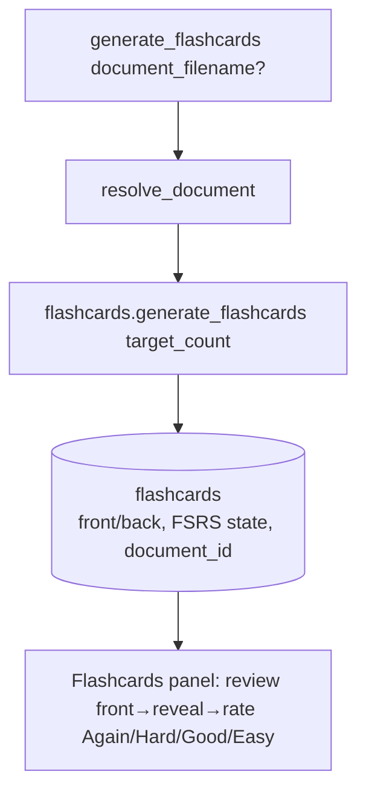
```mermaid
flowchart TD
    A["generate_flashcards document_filename?"] --> R["resolve_document"]
    R --> G["flashcards.generate_flashcards target_count"]
    G --> DB[("flashcards<br/>front/back, FSRS state, document_id")]
    DB --> P["Flashcards panel: review front→reveal→rate Again/Hard/Good/Easy"]
```

### 13. `generate_practice_exam`

Difficulty is adaptive (mean of last 3 completed exam scores), and the answer key stays server-side until completion (router-level leak guard).

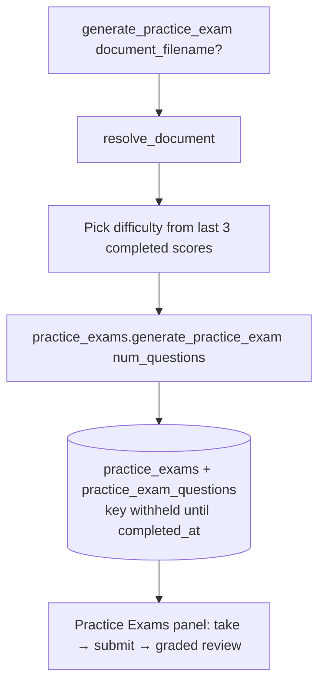
```mermaid
flowchart TD
    A["generate_practice_exam document_filename?"] --> R["resolve_document"]
    R --> D["Pick difficulty from last 3 completed scores"]
    D --> G["practice_exams.generate_practice_exam num_questions"]
    G --> DBE[("practice_exams + practice_exam_questions<br/>key withheld until completed_at")]
    DBE --> P["Practice Exams panel: take → submit → graded review"]
```

### 14. `generate_study_plan`

Re-extracts document text, asks the provider for structured gradable items (real `due_date` when an exact calendar date exists, otherwise honest `due_date_text` like "Week 5"), persists them user-scoped. `document_id` is `ON DELETE SET NULL` so items survive their source document.

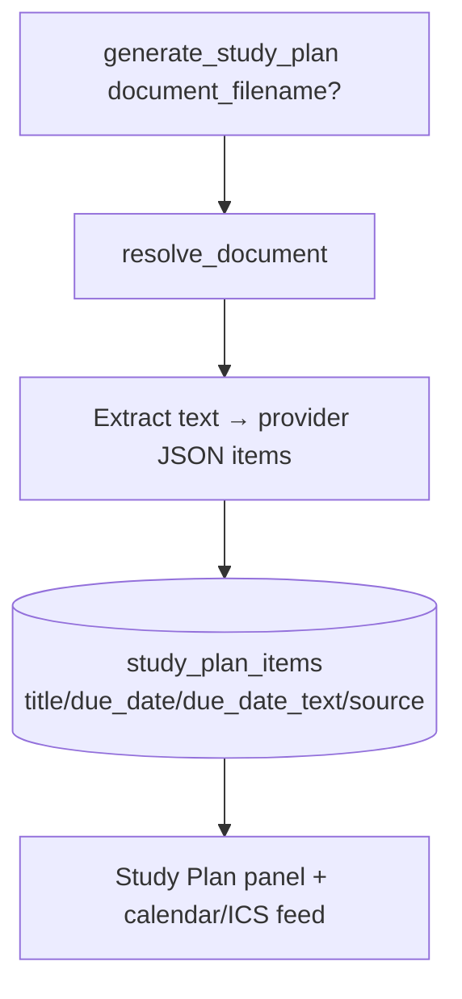
```mermaid
flowchart TD
    A["generate_study_plan document_filename?"] --> R["resolve_document"]
    R --> E["Extract text → provider JSON items"]
    E --> DBS[("study_plan_items<br/>title/due_date/due_date_text/source")]
    DBS --> P["Study Plan panel + calendar/ICS feed"]
```

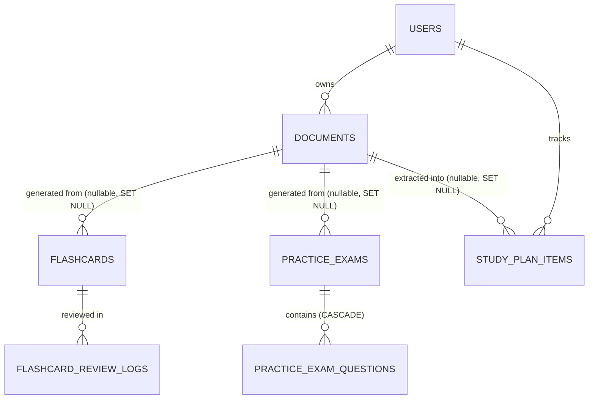
```mermaid
erDiagram
    USERS ||--o{ DOCUMENTS : "owns"
    DOCUMENTS ||--o{ FLASHCARDS : "generated from (nullable, SET NULL)"
    FLASHCARDS ||--o{ FLASHCARD_REVIEW_LOGS : "reviewed in"
    DOCUMENTS ||--o{ PRACTICE_EXAMS : "generated from (nullable, SET NULL)"
    PRACTICE_EXAMS ||--o{ PRACTICE_EXAM_QUESTIONS : "contains (CASCADE)"
    DOCUMENTS ||--o{ STUDY_PLAN_ITEMS : "extracted into (nullable, SET NULL)"
    USERS ||--o{ STUDY_PLAN_ITEMS : "tracks"
```

## 15. `start_study_session` — composite workflow (Pro)

One tool call fans out the trio above concurrently, each on its own `AsyncSession` (sessions are not safe to share across coroutines), then composes one summary. Pro-gated before any work; same `PRO_ONLY_MESSAGE` pattern as the paper/artifact tools.

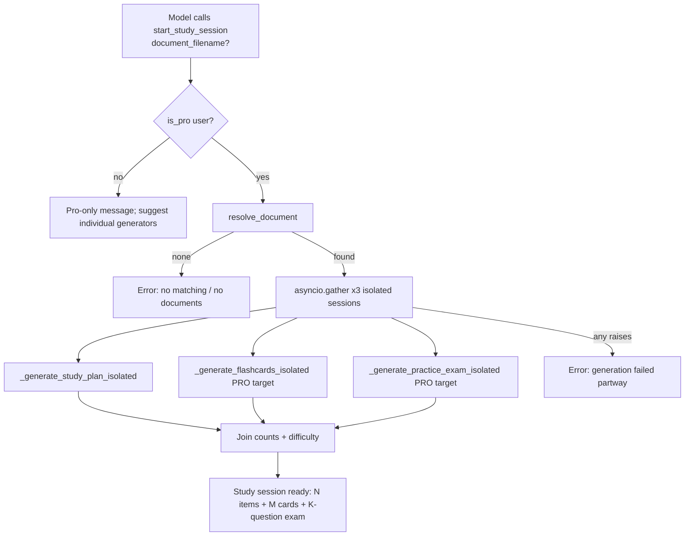
```mermaid
flowchart TD
    M["Model calls start_study_session\ndocument_filename?"] --> PRO{"is_pro user?"}
    PRO -- no --> GATE["Pro-only message; suggest individual generators"]
    PRO -- yes --> RES["resolve_document"]
    RES -- none --> ERR["Error: no matching / no documents"]
    RES -- found --> FAN["asyncio.gather x3 isolated sessions"]
    FAN --> P1["_generate_study_plan_isolated"]
    FAN --> P2["_generate_flashcards_isolated PRO target"]
    FAN --> P3["_generate_practice_exam_isolated PRO target"]
    P1 --> JOIN["Join counts + difficulty"]
    P2 --> JOIN
    P3 --> JOIN
    FAN -- "any raises" --> ERR2["Error: generation failed partway"]
    JOIN --> MSG["Study session ready: N items + M cards + K-question exam"]
```

## 16. `sync_google_classroom` — Classroom connector

Syncs an already-connected account (OAuth connect itself happens in the Study Plan panel's browser flow; a chat tool cannot drive consent). Upserts by external coursework id so re-syncs update instead of duplicating. Tokens encrypted at rest (Fernet).

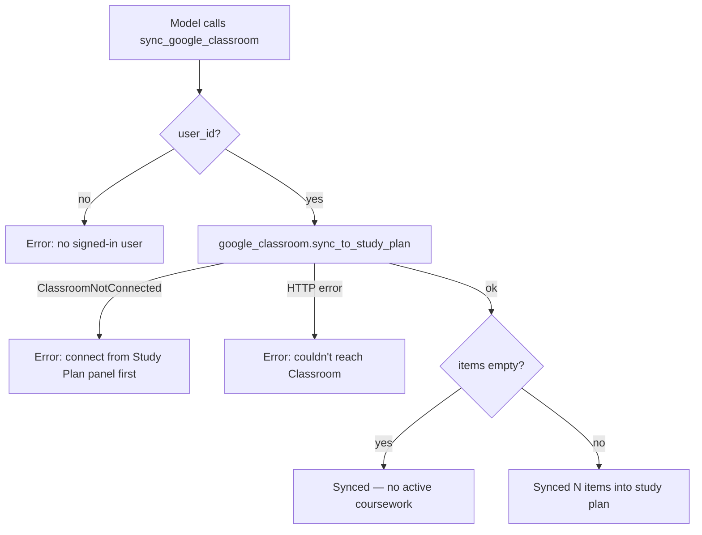
```mermaid
flowchart TD
    M["Model calls sync_google_classroom"] --> CTX{"user_id?"}
    CTX -- no --> ERR0["Error: no signed-in user"]
    CTX -- yes --> SYNC["google_classroom.sync_to_study_plan"]
    SYNC -- "ClassroomNotConnected" --> ERR1["Error: connect from Study Plan panel first"]
    SYNC -- "HTTP error" --> ERR2["Error: couldn't reach Classroom"]
    SYNC -- ok --> NONE{"items empty?"}
    NONE -- yes --> MSG1["Synced — no active coursework"]
    NONE -- no --> MSG2["Synced N items into study plan"]
```

```mermaid
erDiagram
    USERS ||--o| GOOGLE_CLASSROOM_CONNECTIONS : "connects (1:1, encrypted tokens)"
    USERS ||--o{ STUDY_PLAN_ITEMS : "synced into"
    STUDY_PLAN_ITEMS {
        string external_id "Classroom courseWork id, upsert key"
        string source "classroom vs syllabus_upload"
    }
```

## 17. `check_student_work` — verify, don't re-solve

Pedagogical inverse of `symbolic_math`: verifies the student's own typed attempt and pinpoints the first divergence instead of handing back a fresh answer. Math path is objective (strip instruction words → `_looks_like_math` gate requiring operator+digit or math function, so English sentences never reach SymPy → `solve_math` ground truth → symbolic `simplify(true - student) == 0` comparison → CORRECT / INCORRECT / unparseable-fallback). Non-math path returns a careful-verification prompt (independent solve first, then Correct/Partially/Incorrect with quoted step).

```mermaid
flowchart TD
    M["Model calls check_student_work\nproblem, student_work"] --> EMPTY{"Both non-empty?"}
    EMPTY -- no --> ERR["Error: problem/student_work must not be empty"]
    EMPTY -- yes --> MATH{"_looks_like_math after stripping instruction words?"}
    MATH -- no --> CONC["Conceptual prompt: solve independently, verdict + quoted step"]
    MATH -- yes --> OP["_detect_operation + solve_math ground truth"]
    OP -- "parse/compute fail" --> CONC
    OP -- ok --> CMP["_compare_final_answer symbolic"]
    CMP -- "unparseable student final" --> FALL["Ground truth + ask model to walk steps"]
    CMP -- "match" --> CORR["CORRECT, brief encouragement, no re-derive"]
    CMP -- "mismatch" --> INC["INCORRECT + true answer + quote diverging step"]
```

## 17b. `check_code_work` — run the student's own code, report what really happened

The code counterpart of `check_student_work`, and the same pedagogical inverse of `code_interpreter`: it verifies a student's own Python rather than producing code for them. Posts the whole submission (one or more files, unmodified) to `sandbox-runner`'s `POST /run-code` — the multi-file sibling of `/execute`, sharing its `_run_limited` helper and therefore its exact rlimits, ~10s process-group wall-clock watchdog, concurrency semaphore and per-request scratch wipe (no separate, looser budget, unlike `/compile-latex`). With a `test_file`, the sandbox runs pytest and returns **real per-test rows** (nodeid, outcome, pytest's own `longrepr`) collected by a generated `-p _newton_report` plugin rather than by parsing terminal output; without one, it just executes `entrypoint` and returns real stdout/stderr/exit code. The response never layers a model verdict over that: it states the real pass/fail counts, prints the real assertion/traceback per failing test, and instructs the tutor in plain language never to rewrite the student's code or report results from code it changed. Writing `test_file` from the assignment description is explicitly allowed; writing the solution is not.

**Scope: Python only.** Java/C/C++ would need real compiler toolchains in the `sandbox-runner` image plus a per-language compile-then-run step with its own security review — a deliberate, documented deferral, not an oversight (see the module docstring and `services/sandbox-runner/README.md`).

```mermaid
flowchart TD
    M["Model calls check_code_work\nfiles, entrypoint, test_file?"] --> VAL{"files non-empty,\nentrypoint one of them?"}
    VAL -- no --> ERR["Error: ... (never a verdict)"]
    VAL -- yes --> POST["POST sandbox_runner_url/run-code"]
    POST -- "timeout / HTTP error" --> ERR2["Error: could not reach sandbox-runner"]
    POST --> SBX["Validate filenames (no .., no reserved names)\nwrite files byte-for-byte to fresh scratch dir"]
    SBX -- "test_file given" --> PYT["python3 -E -s -m pytest -p _newton_report\nunder /execute's rlimits + watchdog"]
    SBX -- "no test_file" --> SCR["python3 -E -s entrypoint"]
    PYT --> ROWS["Per-test rows from pytest's own reports\n+ collection errors"]
    ROWS --> FMT1["ALL N PASSED (hedged: these tests, not all inputs)\nor TESTS FAILED: counts + real assertion text\n+ 'do not write their code for them'"]
    SCR --> FMT2["Exit code / timed out / real stdout+stderr\n+ 'ran' is not 'correct'"]
    PYT -- "killed by watchdog/RLIMIT_CPU" --> TO["TIMED OUT: never terminated"]
```

## 18. `get_weak_areas` — real performance data

Thin wrapper over `services/weak_areas.py`. No parameters beyond `user_id`: always answers "how is this signed-in student actually doing". Weak card = majority of last 3 reviews rated Again/Hard (FSRS 1/2); missed questions come only from completed exams. Grouped by source `Document` filename (or `general`), sorted by count, with real example fronts/questions (max 5 per group) so the model can reason about the underlying concept. Empty history is a normal "not enough data" message, not an error.

```mermaid
flowchart TD
    M["Model calls get_weak_areas"] --> CTX{"user_id?"}
    CTX -- no --> ERR["Error: no signed-in user"]
    CTX -- yes --> CARDS["Load user's flashcards"]
    CARDS --> PERCARD["Per card: last 3 FlashcardReviewLog, weak if majority ≤2"]
    PERCARD --> EXAMS["Load completed PracticeExams → missed questions is_correct=false"]
    EXAMS --> GROUP["Group by document_id → filename or general, sort by count"]
    GROUP --> FMT{"areas empty?"}
    FMT -- yes --> NODATA["Not enough history; suggest review/exam first, don't guess"]
    FMT -- no --> DATA["Per-area counts + real examples + bias-generation guidance"]
```

```mermaid
erDiagram
    USERS ||--o{ FLASHCARDS : "owns"
    FLASHCARDS ||--o{ FLASHCARD_REVIEW_LOGS : "has (last 3 decide weak)"
    USERS ||--o{ PRACTICE_EXAMS : "took"
    PRACTICE_EXAMS ||--o{ PRACTICE_EXAM_QUESTIONS : "missed where is_correct=false"
    DOCUMENTS ||--o{ FLASHCARDS : "groups by"
    DOCUMENTS ||--o{ PRACTICE_EXAMS : "groups by"
```

## 19. `get_math_hint` — leveled hints, never the answer (until level 3)

Grounded in real `solve_math` computation, so hints are never wrong. Level 1: conceptual nudge naming the technique family (no numbers). Level 2: first concrete step derived from the actual SymPy objects (move-to-one-side, differentiate/integrate first term, standard form, distribute first term). Level 3: full worked answer with instruction to walk through it. Invalid operation/expression errors come from `solve_math` directly.

```mermaid
flowchart TD
    M["Model calls get_math_hint\noperation, expression, hint_level 1-3"] --> SOLVE["solve_math operation, expression (validates + grounds)"]
    SOLVE -- fail --> ERR["Error: ..."]
    SOLVE -- ok --> LVL{"hint_level?"}
    LVL -- "≤1" --> L1["Level 1: approach hint, no numbers"]
    LVL -- "==2" --> L2["_first_step from real sympy objects"]
    L2 -- "step computation fails" --> L2F["Generic: break into pieces, tackle first"]
    LVL -- "≥3" --> L3["Level 3: full answer + walk-through instruction"]
```

## 20. `write_research_paper` — plan → approve → execute (Pro)

The execution half; the plan half needs no tool (Tutor emits a `paper-plan` block: title/style/abstract_sketch/sections/sources_needed). Only call with the exact approved plan, only on explicit approval, never in the same turn as the plan. Pipeline per section (bounded concurrency 3): student-document excerpt + `web_search` + up to 2 allowlist-filtered `research_fetch.fetch` calls (structured `citation_*`/`DC.*` metadata overlaid onto the model's self-reported sources via `_prefer_extracted_metadata`) → one direct provider call returning `{prose with \cite{local-key}, sources[]}` → de-duplicated BibTeX keys (`bibliography.assign_citation_keys`) → `\cite` rewrite → LaTeX render (IEEE/APA7, escaped plain-text fields but untouched body prose so `$math$`/`\cite` survive) → sandbox compile (`pdflatex → biber → pdflatex → pdflatex`, `-no-shell-escape`, one retry feeding the real log back) → store PDF + `.tex` as real `Document` rows with `paper_sources` (enables later `.bib` download). Never fabricate statistics/quotes/results; say so instead. Pro-gated and Focus-Mode-blocked.

```mermaid
flowchart TD
    PLAN["Tutor emits paper-plan block"] --> APPROVE{"Student approves exact plan?"}
    APPROVE -- "changes requested" --> PLAN
    APPROVE -- approved --> TOOL["Model calls write_research_paper\ntitle/style/abstract/sections/document_filename?"]
    TOOL --> GATE1{"is_pro?"}
    GATE1 -- no --> PROMSG["Pro-only message"]
    GATE1 -- yes --> GATE2{"focus_mode on?"}
    GATE2 -- yes --> FOCUSMSG["Focus Mode message"]
    GATE2 -- no --> VALID["Validate style/title/abstract/non-empty sections"]
    VALID -- invalid --> ERR["Error: ..."]
    VALID -- ok --> DOC["Optional: resolve document, excerpt 6000 chars"]
    DOC --> FAN["Per section, semaphore 3: gather + draft"]
    FAN --> GATHER["web_search heading + up to 2 research_fetch.fetch allowlisted URLs"]
    GATHER --> META["Overlay real citation_* metadata onto model sources"]
    META --> DRAFT["One provider call per section → prose + sources JSON"]
    DRAFT --> BIB["assign_citation_keys dedup + rewrite cite keys"]
    BIB --> TEX["Render LaTeX IEEE/APA7 + assemble .bib"]
    TEX --> COMPILE["compile_latex via sandbox-runner"]
    COMPILE -- fail --> RETRY["One retry with real compiler log"]
    RETRY --> DONE{"success + pdf_bytes?"}
    COMPILE -- ok --> DONE
    DONE -- no --> ERR2["Error: LaTeX did not compile + real log tail"]
    DONE -- yes --> STORE["upload_document_bytes PDF + TEX with paper_sources"]
    STORE --> MSG["Done: title, style, N sections, M sources, saved filenames"]
```

```mermaid
erDiagram
    USERS ||--o{ DOCUMENTS : "reads excerpt from + writes PDF/TEX into"
    DOCUMENTS {
        string kind "upload source vs generated output"
        jsonb paper_sources "de-duplicated bibliography for .bib download"
    }
```

## 21. `create_artifact` — persona → coding agent → live mini-app (Pro, metered)

Sibling of the paper tool: Pro-gated multi-stage generation with its own direct provider calls. Two stages: (1) an artifact-agent persona (diagram/chart/slideshow/interactive/quiz) turns the student's request into a concrete coding brief (`TITLE:` + who/what/layout/interaction/failure-modes, respecting one-self-contained-HTML/no-CDN/no-network/360px/accessibility constraints); (2) headless `opencode` in `artifact-runner` iteratively writes `artifact.html` with validator self-correction. Quiz-over-named-material is grounded: real cards/text are read from the DB and appended by code after the persona speaks (`_ground_brief`), so the agent cannot invent "their" questions. Real token spend (brief + build) is charged via `billing.record_frontier_usage` (monthly allowance first, then top-up), even on failed builds. Result is a `newton-artifact` fenced block carrying only `{document_id, title, kind, attempts}`; the frontend fetches bytes from `GET /documents/{id}/raw` into a sandboxed iframe. Same plan → approve flow as papers (`artifact-plan` block first, never speculative; prefer `plot_function`/chat explanation when those suffice; prefer flashcards/exams over a quiz artifact unless the game itself is the ask).

```mermaid
flowchart TD
    PLAN["Tutor emits artifact-plan kind/title/summary"] --> APPROVE{"Student approves?"}
    APPROVE -- changes --> PLAN
    APPROVE -- approved --> TOOL["Model calls create_artifact kind/prompt/document_id?"]
    TOOL --> G1{"is_pro?"}
    G1 -- no --> PMSG["Pro-only message + cheaper alternatives"]
    G1 -- yes --> G2{"focus_mode on?"}
    G2 -- yes --> FMSG["Focus Mode message"]
    G2 -- no --> G3{"frontier_access_available credit?"}
    G3 -- no --> CMSG["No-credit message"]
    G3 -- yes --> QUIZ{"kind==quiz and document named?"}
    QUIZ -- yes --> GROUND["_quiz_source_block: real cards or real text, else honest refusal"]
    GROUND -- "no such / empty document" --> REFUSE["Refusal message, zero spend"]
    QUIZ -- no --> BRIEF
    GROUND -- block --> BRIEF["_write_brief: persona provider call → TITLE + brief"]
    BRIEF --> ATTACH["_ground_brief: code-appends verbatim material"]
    ATTACH --> BUILD["build_artifact brief via artifact-runner opencode"]
    BUILD --> CHARGE["_charge_usage real tokens even on failure"]
    CHARGE --> OK{"success + html?"}
    OK -- no --> FAIL["_failure_summary: timeout or validator problems"]
    OK -- yes --> STORE["store_artifact_html kind=artifact + RAG description"]
    STORE --> FENCE["```newton-artifact document_id/title/kind/attempts ``` verbatim"]
```

```mermaid
flowchart TD
    REQ["Student: 'quiz me on my Bio 101 deck'"] --> DBQ[("DB: build_flashcard_decks<br/>or get_document_text")]
    DBQ --> PRE["_CARDS_PREAMBLE or _TEXT_PREAMBLE + verbatim rows"]
    PRE --> PERSONA["Quiz persona: game design, no re-listing"]
    PERSONA --> CODE["_ground_brief attaches verbatim block first-budget"]
    CODE --> AGENT["Coding agent: questions array from block only"]
```

```mermaid
erDiagram
    USERS ||--o{ DOCUMENTS : "owns artifact"
    DOCUMENTS {
        string kind "artifact"
        string minio_key "self-contained HTML bytes"
    }
    USERS {
        int credits_used_cents "monthly allowance spend"
        int topup_credits_cents "purchased balance"
    }
```

Artifact kinds (personas): `diagram` (one relationship, correct topology, labelled arrows, inline SVG), `chart` (question-driven type, zero-baseline bars, real stated numbers, finding-as-title, hand SVG), `slideshow` (one idea/slide, 6–10, persistent object, navigable divs), `interactive` (manipulation-is-lesson, surprising parameter, live feedback + readouts, plain JS), `quiz` (commit-before-reveal, immediate feedback, streak + position, shuffle + retry-missed, honest distractors from same material).

## 22. Voice I/O — `voice_stt` / `voice_tts` (service clients, not tools)

Deliberately not `Tool` subclasses: audio bytes cannot flow through JSON tool arguments, and transcription happens before the model ever sees the turn (STT) or on finished text after it (TTS). Same `base_url`/`transport`/clean-error-string shape as other tools for testability. Both endpoints Pro-gated; 20MB audio cap; STT posts multipart to whisper-asr `/asr`, TTS posts JSON to piper-tts `/synthesize` and returns WAV bytes.

```mermaid
flowchart TD
    subgraph STT["POST /voice/transcribe"]
        MIC["Frontend mic recording"] --> UP["Upload audio file ≤20MB"]
        UP --> PRO1{"is_pro?"}
        PRO1 -- no --> E402A["402 Voice is Pro"]
        PRO1 -- yes --> WHISPER["VoiceSTTClient → whisper-asr /asr"]
        WHISPER -- fail --> E502A["502 STT error"]
        WHISPER -- ok --> TEXT["{text} → composer for edit before send"]
    end
    subgraph TTS["POST /voice/synthesize"]
        BUB["Listen on assistant message"] --> BODY["{text}"]
        BODY --> PRO2{"is_pro?"}
        PRO2 -- no --> E402B["402 Voice is Pro"]
        PRO2 -- yes --> PIPER["VoiceTTSClient → piper-tts /synthesize"]
        PIPER -- "fail/empty" --> E502B["502 TTS error"]
        PIPER -- ok --> WAV["audio/wav bytes → player"]
    end
```

## 23. `use_capability` — the meta-tool

Not a domain tool and never in `_TOOLS`; handled inline by `tutor._load_capabilities`. Its description text is generated from `_ON_DEMAND_GROUPS` so it cannot drift from the real belt. One call can name several tools; silently ignores core/`read_image`/already-loaded/unknown names and says what actually loaded. Costs one extra model round before the newly loaded tool can be called (the reason `MAX_TOOL_ROUNDS` is 6).

```mermaid
flowchart TD
    M["Model calls use_capability\nnames: [...]"] --> NORM["Normalize to list"]
    NORM -- "not a list" --> ERR["Error: names must be a list"]
    NORM -- list --> EACH["Per name: must be on-demand + not loaded + real spec"]
    EACH --> APPEND["Append ToolSpec to live tools list in place"]
    APPEND --> MSG1["Loaded: a, b. Call them directly now."]
    EACH -- "all skipped" --> MSG2["No new tools loaded — already loaded/unknown/invalid"]
```

## Cross-cutting concerns

- **Pro gating is uniform:** `billing.is_pro(user)` for `start_study_session`, `write_research_paper`, `create_artifact`, and both voice endpoints. Papers and artifacts add a Focus-Mode block; artifacts add a `frontier_access_available` credit check and real usage charging.
- **Free vs Pro generation counts:** flashcards / practice exams aim for 5 (free) vs 15 (Pro) items per call; unlimited separate calls on either plan.
- **Document scoping:** every `document_filename`/`document_id` hint resolves only within the calling user's own `documents`; cross-user reads are rejected explicitly in the artifact quiz path and structurally elsewhere via `user_id` filters.
- **Frontend fenced blocks produced by tools:** `plotly-figure` (visualizer), `newton-artifact` (artifacts), `math-steps`/`paper-plan`/`artifact-plan`/`options` (Tutor narration, not tools but part of the same UX contract).
